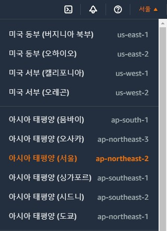
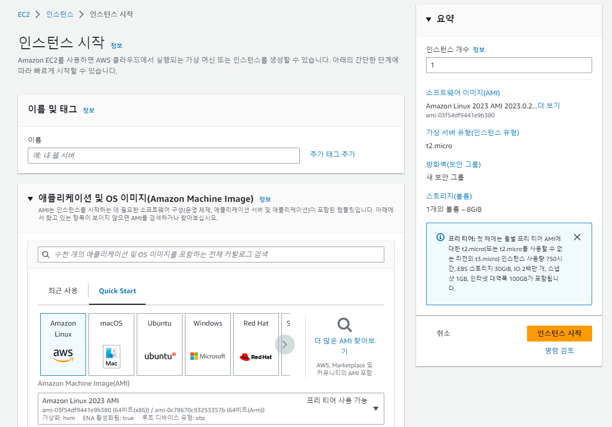
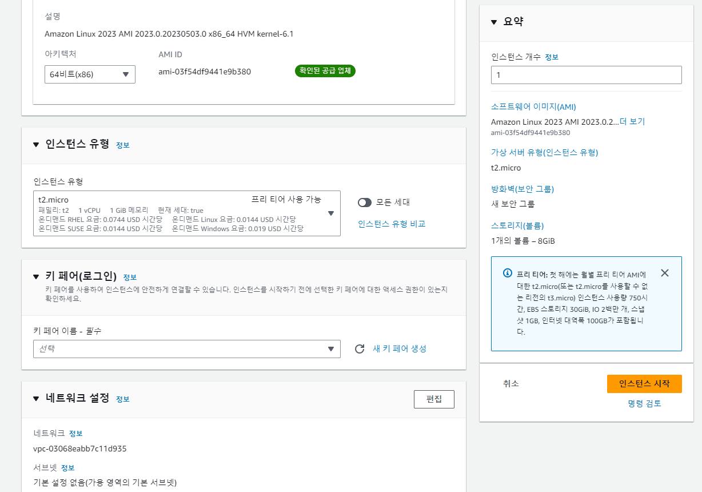
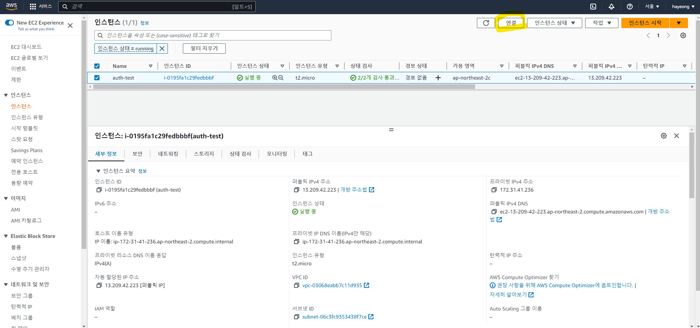
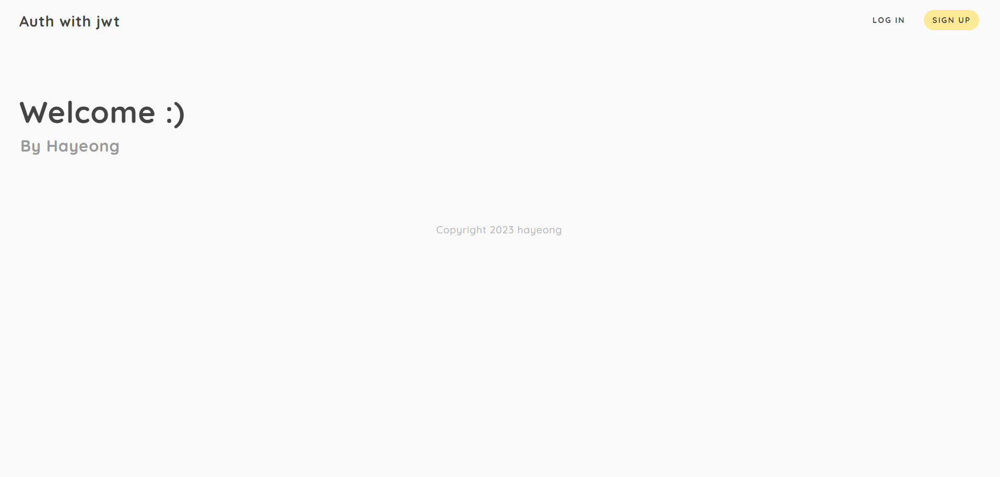

**AWS**는 **Amazon Web Service**의 약어로 대표적인 클라우드 플랫폼입니다.<br/>
AWS는 계정 생성 후 1년 동안 일정 무료 사용량을 제공하는 프리티어 서비스를 제공합니다.

## 시작하기

### 1) AWS 계정 생성, region 설정
개인정보와 결제 카드 등을 등록해서 AWS 가입을 해줍니다. 
상단 메뉴에서 지역은 **아시아 태평양 (서울) ap-northeast-2**로 설정해 줍니다.



### 2) 인스턴스 시작

메인 화면에서 EC2 서비스를 클릭하거나, 상단 검색 메뉴에서 EC2를 검색하면 다음과 같은 대시보드를 확인 할 수 있습니다.


인스턴스 시작 버튼을 누르면 클라우드 서버 구축을 시작하는 것입니다.

### 3) AMI 선택(어떤 종류의 서버 컴퓨터를 돌릴 것인지)



저는 **Amazon Linux**를 선택하였습니다. 이 중 프리티어 사용가능이 아닌 OS도 있으니 잘 보고 선택해야 합니다.

### 4) 인스턴스 유형 선택



프리티어를 마음 편하게 사용하려면 메모리 1GB의 **t2.micro** 밖에 선택사항이 없습니다.. 😂

### 5) 인스턴스 세부 정보 변경

바로 [검토 및 시작] 버튼을 눌러도 잘 생성되지만, [인스턴스 세부 정보 변경] 버튼을 눌러 세부사항을 입맛에 맞게 변경할 수 있습니다.<br/>
저는 따로 변경하지 않고 진행하였습니다.

### 6) 키 페어 설정

새 키 페어 생성 버튼을 누르면 키 페어 이름을 입력해주고, 다운로드 된 키페어 파일을 로컬 컴퓨터에 잘 저장해 놓아야 합니다. 이름은 뭐든 괜찮습니다.<br/>
키 페어 다운로드 버튼을 누르면 `.pem` 파일이 다운로드 됩니다.

### 7) 보안 그룹 설정

보안 그룹은 EC2 인스턴스에 접근할 수 있는 그룹입니다.<br/>
보안이 중요하다면 접근 가능한 포트와 IP를 지정하는 것이 좋습니다.<br/>
저는 일단 기본으로 진행했습니다.

이제 인스턴스 시작 버튼을 누르면 EC2 인스턴스 생성이 완료됩니다.<br/>
터미널에서 인스턴스에 접근해서 서버 코드를 올리고 서버를 구동할 수 있습니다.



이제 인스턴스가 잘 생성되었습니다. 연결 버튼을 눌러 터미널을 열어줍니다.

이제 하단 명령어를 통해 제가 만든 서비스를 설치해 줍니다.
저는 git을 설치해서 해당 레포지토리를 클론한 뒤 서버를 실행시키는 방법을 사용하였습니다.

```shell
$ pwd
/home/ec2-user 뜨면 잘 연결된 겁니다🎉

$ sudo yum update y   // yum update를 해줍니다.
```

git을 설치해 줍니다.

```shell
$ sudo yum install git -y

$ git --version
git version 2.34.1.windows.1  // git 버전이 잘 뜨면 성공🎉
```

이제 git 레포지토리를 클론하여 가져옵니다.

```shell
git clone https://github.com/본인깃허브아이디/레포지토리.git
```

그럼 다음과 같이, username과 password를 입력합니다.

```shell
Username for 'https://github.com': 깃허브아이디
Password for 'https://kirahaa@gmail.com': 
```

패스워드는 **github 로그인 > Settings > Developer settings > Personal access tokens > Generate New Token > 필요항목 입력(repository만 체크) 후 Generate Token**

생성된 토큰을 **Ctrl + shift + v** 해서 붙여넣기 해줍니다.

이제 생성된 디렉토리를 확인해 줍니다.

```shell
$ ls 
// 생성된 레포 뜸 ex) auth-with-jwt
```

해당 디렉토리로 들어갑니다.


자 이제, `npm install`을 해서 패키지들을 설치해 주어야 하는데,<br/>
npm을 입력하면 `-bash: npm: command not found`라고 뜰 것입니다.<br/>
그럼 다음 명령어들을 순서대로 쳐줍니다.

```shell
$ curl -o- https://raw.githubusercontent.com/nvm-sh/nvm/v0.34.0/install.sh | bash

$ . ~/.nvm/nvm.sh

$ nvm install node
```

이제 node를 설치해야 하는데, `nvm install node`하면 에러가 뜰 것입니다.<br/>
버전 문제 때문에 다음과 같이 16버전을 다운받아 주어야 합니다.

```shell
nvm install 16
```

node가 잘 설치되었나 버전 확인을 해줍니다.

```shell
node -v
```

이제 `package.json` 내 패키지들을 설치해 줍니다.

여기서 잠깐! git에는 mongodb 정보가 담겨있는 `config.js`파일이 제외되어 있어서, 새로 만들어줘야 했습니다.

```shell
$ cat > config.js
```

`cat` 명령어를 통해 파일 생성이 되면 내용을 바로 입력할 수 있습니다.
(참고: https://heytech.tistory.com/33)

```js
module.exports = {
  'secret': 'SeCrEtKeYfOrHaShInG',
  'mongodbUri': 'mongodb+srv://<본인 아이디>:<패스워드>@mycluster.likcia7.mongodb.net/?retryWrites=true&w=majority'
}
```

```shell
// 저장 및 종료
키보드 control과 z 버튼 동시에 눌러주기.
```

괄호가 잘 안닫혔는지, `node app.js` 명령어를 실행해 주었더니, 오류가 떴습니다.😥<br/>
그래서 다시 `config.js` 파일 수정해주기!

```shell
// 편집 및 저장
// 편집 명령어
$ vi 파일명.확장자명
```

명령어 입력 후 엔터를 눌러주면 기존에 저장한 내용이 나옵니다.<br/>
확인해보니 역시 닫는 괄호가 잘 안 닫혀있어, 파일을 수정해 줍니다.<br/>

편집을 모두 마쳤다면, 키보드 `ESC`를 눌러 편집 기능을 비 활성화 해줍니다.<br/>
이제 마지막으로 `:wq`를 입력하고 `Enter`를 눌러주면 파일이 저장되고 터미널로 화면이 전환됩니다.<br/>
이제 다시 `node app.js` 명령어를 통해 서버를 실행해 줍니다!🎉

## 8) 인바운드 규칙 추가

이제 마지막 단계입니다!

퍼블릭 IPv4 주소인 **13.209.42.233**으로 접속했더니 잘 되지 않습니다.<br/>
그건 저희가 포트 3000번에 열었기 때문인데요, 그래서 **13.209.42.233:3000**으로 접속해 줍니다.
그래도 아마 접속이 안될 것입니다ㅠㅠ

자 이제 다시 aws 인스턴스 페이지로 돌아가서 왼쪽 메뉴에서 **네트워크 및 보안 > 보안 그룹**에 들어갑니다.

해당 인스턴스 이름을 클릭한 뒤, 하단에 보이는 **인바운드 규칙 > 인바운드 규칙 편집**을 눌러 포트를 새로 추가해 줍니다.

현재 제 인바운드 리스트에는 세가지가 있는데요.


| 유형       | 프로토콜 | 포트 범위 | 소스                          |
|:------------|:----|:------|:----------------------------|
| SSH | TCP | 22    | 0.0.0.0/0                |
| HTTP  | TCP | 80    | 0.0.0.0/0                  |
| 사용자 지정 TCP | TCP | 3000  | 0.0.0.0/0     |

이렇게 추가해 주시면 됩니다.

그럼 이제 주소창에 **13.209.42.233:3000**을 입력하면

aws 서버 만들기 완료입니다!!🎉🎉🎉




### ➕ 이후 찾은 문제점<br/>

위 과정으로 aws 인스턴스가 잘 만들어졌다고 생각했는데, 서버가 자꾸 끊기는 문제가 발생했습니다.<br/>
아직 정확한 문제를 찾지는 못했으나, ec2의 t2.micro의 작은 메모리이다 보니, 끊기는 것은 어쩔 수 없는 문제인가 봅니다..

---

### 에필로그

여기까지 node.js의 express를 활용한 jwt 인증 구현을 해보았는데요, 사실 이번에는 튜토리얼 영상을 보며 코드를 따라친 느낌이라 그냥 찍먹한 느낌입니다..ㅎㅎ

그래도 데이터베이스도 직접 만져보고, aws 인스턴스도 만들어보고 찍먹러로써는 정말 좋은 경험이었습니다! <br/>
하나의 프로젝트의 처음부터 끝까지 경험해보고 싶다면 추천합니다! 👍

---

#### 참고 자료

- https://www.youtube.com/watch?v=_bu6etIS_bo
- https://makethree.tistory.com/4