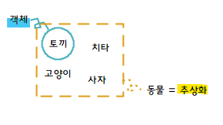

> 📌 **1주차 - Assignment #02**
> #### 📚 TIL (2024.01.27) - 추천사 ~ 1장. 깨끗한 코드

### 책에서 기억하고 싶은 내용을 써보세요.

#### 추천사

"사소한 곳에서 발휘하는 정직은 사소하지 않다."

##### 품질 관리론 S5 규칙
- 정리: 무엇이 어디에 있는지 알아야 한다.
- 정돈: 코드는 누구나 예상하는 위치에 있도록 정돈한다.
- 청소: 필요없는 주석 등은 제거한다.
- 청결(표준화): 공통으로 사용하는 코드 스타일과 기법 등의 필요성.
- 생활화: 주기적으로 코드를 돌아보자.

"첫 아이 이름을 짓듯이 심사숙고해서 변수 이름을 지어야 한다."

"일관적인 들여쓰기 스타일이 버그 수를 줄여주는 가장 중요한 요인 중 하나라고 추측하게 되었다."

"사소한 것에 집중할 뿐 아니라 사소한 것에 정직해야 한다." 
코드에 정직하고, 코드의 상태에 관하여 동료들에게 정직하고, 무엇보다도, 자기 코드에 대해서 자신에게 정직하라는 뜻이다.

#### 1장. 깨끗한 코드

##### 르블랑의 법칙 
"나중은 절대 오지 않는다." - 한번 작성한 쓰레기 코드를 나중에 수정하는 일은 결코 없다.

좋은 코드를 사수하는 일은 바로 우리 프로그래머들의 책임이다.
나쁜 코드의 위험을 이해하지 못하는 관리자 말을 그대로 따르는 행동은 전문가답지 못하다. 
기한을 맞추는 유일한 방법은, 그러니까 빨리 가는 유일한 방법은, 언제나 코드를 최대한 깨끗하게 유지하는 습관이다.

우아한 코드: "외양이나 태도가 기품 있고 단아하며 보기에 즐거운" 코드

나쁜 코드는 나쁜 코드를 '유혹'한다! 
창문이 깨진 건물은 누구도 상관하지 않는다는 인상을 풍긴다. 사람들도 관심을 끊는다. 
창문이 더 깨져도 상관하지 않는다. 
나쁜 코드는 너무 많은 일을 하려 애쓰다가 의도가 뒤섞이고 목적이 흐려진다. 

##### 깨끗한 코드란?

깨끗한 코드는 한가지에 '집중'한다.

깨끗한 코드는 단순하고 직접적이다. 깨끗한 코드는 잘 쓴 문장처럼 읽힌다.

깨끗한 코드란 다른 사람이 고치기 쉽다.

깨끗한 코드는 주의 깊게 작성한 코드다. 누군가 시간을 들여 깔끔하고 단정하게 정리한 코드다.

중복 줄이기, 한 기능만 수행하기, 제대로 표현하기, 작게 추상화하기.

읽으면서 짐작한 대로 돌아가는 코드가 깨끗한 코드다.

##### 보이스카우트 규칙
캠프장은 처음 왔을 때보다 더 깨끗하게 해놓고 떠나라.

### 오늘 읽은 소감은? 떠오르는 생각을 가볍게 적어보세요.

사실 당연하다고 생각해던 이론들이 실무를 하다보면 당연하지 않다는 걸 느낀다.

일을 하다보면 기한이 촉박하다는 이유로, 더럽고 지저분한 코드를 짜게 되는 경우가 많다.
하지만 언제나 그랬듯 빨리 가는 유일한 방법은 코드를 깨끗하게 유지하는 습관밖에 없다는 것이다.

코드를 짜다보면 생각없이 짜게 되는 경우가 많았는데, 시간을 들여 주의 깊게 작성해야 겠다는 반성을 했다. 
나중에 고치겠다는 생각하지 말고, 처음부터 제대로 잘 작성하자!

### 궁금한 내용이나, 잘 이해되지 않는 내용이 있다면 적어보세요.

책에서도 "명쾌한 추상화", "작게 추상화하라"라는 말이 나오는데, 항상 **추상화**라는 개념이 헷갈린다.

**추상화**: 공통의 속성이나 기능을 묶어 이름을 붙이는 것으로 객체 지향적 관점에서 클래스를 정의하는 것을 추상화라고 할 수 있다.

**추상화**란 현실 세계에서 존재하는 모든 사물의 공통점과 공통 기능을 유추해서 클래스를 만들어내는 일련의 과정이다.
예를 들어, 토끼, 고양이, 사자, 치타가 있을 때 이것들을 각각의 객체라 하며 이 객체들을 하나로 묶으려 할 때, 동물 또는 생물이라는 어떤 추상적인 객체로 크게 정의한다고 하자.
이때 동물 또는 생물이라고 묶는 것을 **추상화**라고 한다. **추상화는 다른 객체들과는 구분되는 핵심적인 특징들에만 집중함으로써, 복잡도를 관리할 수 있도록 한다.**

