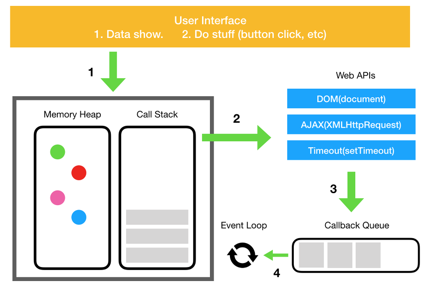

> Reference: [지금까지 받았던 신입 프론트엔드 면접 질문들 by arthur](https://velog.io/@arthur/%EC%A7%80%EA%B8%88%EA%B9%8C%EC%A7%80-%EB%B0%9B%EC%95%98%EB%8D%98-%EC%8B%A0%EC%9E%85-%ED%94%84%EB%A1%A0%ED%8A%B8%EC%97%94%EB%93%9C-%EB%A9%B4%EC%A0%91-%EC%A7%88%EB%AC%B8%EB%93%A4#%EC%82%AC%EC%84%A4)

> 개인 스터디 글로, 맞지 않는 내용이 있다면 피드백은 대 환영입니다 👼✨

### 자바스크립트는 무슨 언어인가요?

자바스크립트는 본래 브라우저를 제어하는 언어였으나, **Node.js**라는 새로운 실행환경과 구글 V8엔진의 등장으로 자체 어플리케이션을 만들 수 있게 된 언어입니다.<br/>
또한 자바스크립트는 명령형, 함수형, 객체지향 프로그래밍이 모두 가능한 멀티 패러다임 언어입니다.

### 변수 선언, 초기화, 할당의 차이점에 대해 설명해주세요.

변수는 **선언 => 초기화 => 할당** 단계를 거칩니다.

변수 선언은 변수를 생성하는 것을 의미합니다. 변수명(식별자)을 등록하여 스코프가 참조할 대상을 만듭니다.<br/>
초기화는 메모리에 변수 저장을 위한 공간을 확보하는 단계입니다. 기본값으로 **undefined**가 할당됩니다.<br/>
할당은 **=** 연산자를 사용하여 값을 할당하는 단계로, **undefined**로 초기화된 변수에 실제 값을 할당해주는 단계입니다.

```js
var name;  // 변수 선언
var name;  // 변수 선언 => 초기화
console.log(name);  // undefined

name = 'hayeong';  // 변수 할당
console.log(name);  // hayeong
```

### 데이터 타입에 대해 설명해주세요.

Javascript의 타입은 **원시 타입**과 **객체 타입**으로 나뉩니다.

원시 타입은 불변값이라고도 부르며, **string**, **number**, **boolean**, **undefined**, **null**, **symbol** 총 6가지 데이터 타입이 있습니다.<br/>
객체는 원시 타입을 제외한 나머지 값들(배열, 함수, 정규표현식 등) 모두 객체에 해당되며, 참조형 타입이라고도 부릅니다. 

### 생성자에 대해 설명해주세요.

생성자 함수란 **new** 연산자와 함께 호출하여 객체를 생성하는 함수를 의미합니다.<br/>
생성자 함수에 의해 생성된 객체를 인스턴스라하며, 자바스크립트는 **Object** 외에도 다양한 타입의 빌트인 생성자 함수를 제공합니다.<br/>
생성자 함수는 일반 함수와 동일한 방법으로 정의하지만, 파스칼 케이스를 사용하는 관례를 따릅니다.

### this에 대해 설명해주세요.

**this** 키워드는 자신이 속한 객체를 가리키는 식별자를 참조할 수 있는 키워드입니다.<br/>
**this**는 함수가 호출되는 방식에 따라 달라집니다.<br/>

- 일반 함수 호출을 사용할 경우 기본적으로 전역 객체가 바인딩됩니다.
- 메서드 호출을 할 경우, 마침표 연산자 앞에 기술한 객체가 바인딩됩니다.
- 생성자 함수 호출을 할 경우, 미래에 생성할 인스턴스가 바인딩됩니다.
- 화살표 함수는 **this**가 없기 때문에, 선언될 시점에서의 상위 스코프가 바인딩됩니다.

#### call, apply, bind에 대해 설명해주세요.

이 세가지 메서드는 강제로 **this**를 바꿀 수 있습니다.

**call**은 커스텀 this를 지정할 수 있고, **apply**는 call과 유사하지만 인자로 배열을 받는다는 점에서 차이가 있습니다.<br/>
**bind**는 커스텀 this를 영구히 가지는 함수를 만들 수 있습니다.

### 콜백 함수에 대해 설명해주세요.

콜백 함수는 다른 함수의 인자로 넘겨지는 함수를 말합니다.<br/>
콜백 함수는 일반적으로 비동기적인 상황에서 사용되며, 어떤 작업이 완료되거나 특정 이벤트가 발생했을 때 호출됩니다.

#### 콜백 지옥을 해결하는 방법을 설명해주세요.

콜백 지옥은 비동기 처리 로직을 위해 콜백 함수를 연속으로 중첩하여 사용할 때 발생하는 문제입니다.<br/>
콜백 지옥을 해결하는 방법에는 **Promise**나 **Async**가 있습니다.<br/>

**Promise**는 비동기 연산이 종료된 이후에 결과를 알기 위해 사용하는 객체입니다.<br/>
**Promise**의 **.then**을 사용해 함수 실행 순서를 정할 수 있습니다.<br/>

ES8에서 도입된 **async**, **await**을 사용하면 비동기 함수를 마치 동기적 코드인 것처럼 동작하도록 구현이 가능합니다.<br/>
**async**함수는 **async** 함수 안에서만 동작하며, **await** 키워드를 쓰게 되면 해당 값이 반환 되기 전까지 기다리는 동안 **async** 내부 함수는 일시 중단이 됩니다.

### Promise에 대해 설명해주세요.

**Promise**는 비동기 처리를 간편하게 처리할 수 있도록 도와주는 객체로, 성공 또는 실패 상태를 가집니다.<br/>
비동기 작업이 완료되면 **resolve(성공)** 또는 **reject(실패)** 로 결과를 처리할 수 있습니다. 이렇게 처리된 결과는 **then**과 **catch** 메서드를 이용하여 다음 동작을 연결할 수 있습니다.
이를 통해 비동기 코드를 더 구조적이고 유지보수하기 좋게 작성할 수 있으며, 에러 처리 등을 통해 안정적인 프로그래밍을 할 수 있습니다.

#### Promise.all()에 대해 설명해주세요.

Promise.all()은 자바스크립트의 Promise 메서드로, 여러 개의 Promise 객체를 받아 모든 Promise가 완료될 때까지 기다린 뒤, 그 결과들을 배열로 반환합니다.<br/>
모든 Promise가 성공적으로 처리되면 배열에는 각 Promise의 성공 결과 값이 순서대로 들어가며, 하나라도 실패하면 첫 번째 실패한 Promise의 에러를 반환합니다.

### Promise와 Callback을 비교 설명해주세요.

Callback은 비동기 작업 완료 후 실행되는 함수로, 가독성과 유지보수에 어려움이 있을 수 있습니다.<br/>
Promise는 ES6에서 도입된 비동기 처리 객체로, 콜백 지옥을 피하고 더 편리한 비동기 작업을 가능하게 해줍니다.<br/>
성공 또는 실패 시 다른 처리를 할 수 있고, 여러 개의 비동기 작업을 체이닝하여 순차적 또는 병렬로 실행할 수 있습니다.

### Promise와 Async, Await의 차이를 설명해주세요.

Promise는 비동기 작업을 처리하는 객체로, then과 catch를 사용하여 결과를 다룹니다.<br/>
Async/Await은 Promise를 더 간결하고 직관적으로 사용하기 위한 문법으로, async 함수와 await 키워드를 사용합니다.<br/>
비동기 작업의 결과를 변수에 할당하거나 다른 함수에서 사용하기 용이하며, try-catch 문으로 예외 처리를 간편하게 할 수 있습니다.

### AJAX에 대해 설명해주세요.

AJAX는 웹 페이지에서 비동기적으로 서버와 데이터를 주고받는 기술로, 페이지 새로고침 없이 동적으로 내용을 갱신하거나 데이터를 로드할 수 있게 해주는 기술입니다.
Javascript를 사용하여 비동기 통신을 수행하며, 사용자 경험을 향상시키고 웹 페이지의 속도와 효율성을 개선합니다.


### var, let, const 차이를 설명해주세요.

**var**는 함수 스코프를 가집니다. 변수를 중복 선언해도 오류가 발생하지 않고, 똑같은 이름으로 여러번 선언되면 마지막 선언이 유효합니다.
호이스팅 현상이 발생하여 변수가 선언되기 전에도 사용할 수 있습니다.

**let**과 **const**는 중복 선언이 불가능 하며, 블록 스코프를 가집니다. <br/>
**let**은 값이 변경될 수 있는 변수를 선언할 때 사용하고, **const**는 값이 변경되지 않을 변수를 선언할 때 사용합니다.

일반적으로 let과 const를 사용하여 변수를 선언하고, var는 최신 버전의 Javascript에서는 피하는 것이 좋습니다.

#### TDZ에 대해 설명해주세요.

TDZ(Temporal Dead Zone)의 약어로, 변수가 선언되었지만 해당 변수를 사용할 수 없는 현상을 가리킵니다.
TDZ는 변수가 선언되고 초기화되기 전까지의 영역을 의미하는데, ES6의 let과 const는 변수를 블록의 상단으로 호이스팅하지만 초기화하지는 않기 때문에 이런 현상이 발생합니다.

### 함수 선언문과 함수 표현식의 차이에 대해 설명해주세요.

함수 선언문은 `function add(x, y){}`의 형태로 쓰여지며, 완료시 undefined가 출력됩니다. 이때, 이름을 생략할 수 없습니다.

함수 표현식은 `const add = function(x, y) {}`의 형태로 쓸 수 있으며, 함수 리터럴의 함수 이름을 생략할 수 있습니다.

또한 함수 표현식으로 함수를 정의하면 변수 호이스팅이 발생하기 때문에 표현식 이전에 호출할 수 없지만, 함수 선언문으로 정의하면 함수 선언문 이전에 호출할 수 있습니다.

### 이벤트 버블링과 캡처링에 대해 설명해주세요.

이벤트 버블링과 이벤트 캡처링은 브라우저에서 이벤트가 발생했을 때 이벤트가 어떻게 전달되는지를 설명하는 개념입니다.

이벤트 버블링은 자식 요소에 등록된 이벤트 핸들러가 먼저 실행된 후 부모 요소의 핸들러가 실행하는 것을 말합니다. 가장 일반적으로 사용됩니다.

이벤트 캡쳐링은 이벤트가 발생한 부모 요소의 핸들러가 먼저 실행된 후 자식 요소에 등록된 핸들러가 실행됩니다.

이벤트 버블링과 캡쳐링은 이벤트의 전파 방향이 다르므로 이를 이용하여 이벤트를 효율적으로 처리할 수 있습니다. 만약 이벤트 전파를 중단하고 싶다면, `event.stopPropagation()` 메서드를 사용하면 됩니다.

#### 이벤트 위임에 대해서 설명해주세요.

이벤트 위임은 상위 요소에 하나의 이벤트 핸들러를 등록하여 하위 요소들의 이벤트를 한 번에 처리하는 기술입니다. 
많은 수의 하위 요소에 각각 이벤트 핸들러를 등록하는 것보다 메모리 사용을 줄이고 코드를 간결하게 만들어줍니다. 
상위 요소에서 이벤트가 발생하면 이벤트가 해당 요소의 하위 요소들까지 전파되어 처리됩니다.
이를 통해 동적으로 생성된 하위 요소들에 대해서도 하나의 핸들러로 처리할 수 있습니다.

#### 이벤트 위임의 동작 방식에 대해서 설명해주세요.

우선 상위 요소에 이벤트 핸들러를 등록합니다. 하위 요소에서 이벤트가 발생하면 이벤트는 먼저 해당 요소에서 시작하여 상위 요소로 전파됩니다. 
이벤트가 상위 요소까지 전파되면 상위 요소에 등록된 이벤트 핸들러가 이벤트를 캐치하여 처리합니다. 이때 **event.target** 속성을 사용하여 이벤트가 발생한 실제 요소를 식별할 수 있습니다.

### 호이스팅과 발생하는 이유에 대해 설명해주세요.

호이스팅은 Javascript 엔진이 코드를 실행하기 전에 변수와 함수 선언을 스코프의 상단으로 끌어올리는 현상입니다. 
호이스팅이 발생하는 이유는 Javascript 엔진이 코드를 실행하기 전에  선언된 변수와 함수의 선언부를 미리 메모리에 할당하기 때문입니다.
이렇게 선언들이 끌어올려지는 동작으로 인해 해당 변수와 함수를 선언 이전에 사용할 수 있게 되는데, 이것이 호이스팅의 원리입니다.
이러한 동작은 실행 컨텍스트(Execution Context)가 형성되는 과정에서 일어나며, 변수와 함수의 선언부를 메모리에 먼저 올려놓는 것으로 이해할 수 있습니다.

### 스코프(Scope)에 대해 설명해주세요.

스코프는 변수와 함수에 접근할 수 있는 유효한 영역을 나타냅니다. 즉, 변수와 함수가 어디에서 정의되고 어디에서 참조될 수 있는지를 결정하는 규칙입니다.<br/>
Javascript에는 전역 스코프와 지역 스코프가 있습니다. 변수와 함수가 스코프에 따라 유효한 영역이 결정되므로, 스코프의 관리는 변수의 생명주기와 충돌을 방지하는 데 중요한 역할을 합니다.

### 클로저(Closure)에 대해 설명해주세요.

클로저(Closure)는 반환된 내부 함수가 자신이 선언되었을 때의 환경(렉시컬 환경)인 스코프를 기억하여, 그 밖에서 호출되어도 해당 환경에 접근할 수 있는 함수를 의미합니다.

이를 통해 전역 변수를 사용하지 않고도 함수 밖에서 해당 변수에 접근할 수 있는 방법을 만들어 주며, 이는 반환된 함수를 제외하면 외부에서 접근할 수 없으므로 마치 private 변수처럼 사용할 수 있습니다.

클로저는 다음 예시에서 처럼 내부에 선언된 함수가 외부 함수의 지역변수를 사용해줬을 때만 클로저라고 선언됩니다.

```js
function outer() {
  let name = "hayeong";
  if (true) {
    let city = "seoul";
    console.log(city);
    console.log(name);
  }
}
```

```js
const btn = document.querySelector('button')

btn.addEventListener('click', handleClick())

function handleClick() {
  let count = 0;
  return function() {
    count++
    return count
  }
}
```

### 실행 컨텍스트에 대해 설명해주세요.

실행 컨텍스트는 자바스크립트 코드가 실행되는 환경을 말합니다. 자바스크립트 엔진이 코드를 실행할 때, 실행 컨텍스트를 생성하여 코드를 평가하고 실행합니다.
실행 컨텍스트는 코드 실행에 필요한 여러 정보들을 담고 있으며, 함수 실행, 변수 및 함수 선언, 스코프 체인 등을 관리하는데 사용됩니다.

#### 렉시컬 환경(Lexical Environment)에 대해 설명해주세요.

렉시컬 환경은 자바스크립트의 변수와 함수의 이름을 관리하는 공간이라고 생각하면 됩니다.
렉시컬 환경은 **환경 레코드**와 **외부 렉시컬 환경**으로 구성되어 있습니다. 

환경 레코드는 모든 지역변수를 프로퍼티로 저장하고 있는 객체입니다. this, 함수일 경우 매개변수도 포함됩니다.
외부 렉시컬 환경은 현재 렉시컬 환경보다 더 상위의 렉시컬 환경입니다. 
현재 렉시컬 환경에서 원하는 변수를 찾지 못하면 현재 렉시컬 환경이 참조하는 외부 렉시컬 환경으로 검색 범위를 확장하며, 이는 전역 렉시컬 환경까지 반복됩니다.

### 자바스크립트에서 일어나는 데이터 형변환에 대해 설명해주세요.

함수와 연산자에 전달되는 값은 대부분 적절한 자료형으로 자동 변환되며, 이를 형 변환이라고 합니다. 

이는 원시값이 아닌 객체간에도 동작하는데, `Symbol.toPrimitive`를 사용하면 객체를 모든 종류로 형변환할 수 있습니다.

또한 `toString()`이나 `valueof()`를 사용해서도 객체를 정해진 몇몇 타입으로 변환할 수 있습니다.

### 자바스크립트가 동적 언어인 이유는 무엇인가요?

> 여기서 동적 언어란 실행 중에 변수의 데이터 타입을 명시적으로 선언하지 않고도 변수의 타입이 자동으로 결정되며, 변수의 타입이 실행 도중에도 동적으로 변경될 수 있는 언어를 말합니다.

자바스크립트는 **런타임 시 변수의 타입이 결정**됩니다.

즉, 소스가 빌드될 때 자료형이 결정되는 것이 아닌 실행 시 결정됩니다. 이를 통해 런타임까지 타입에 대한 결정을 끌고 갈 수 있지만,
실행 도중 변수에 예상치 못한 타입이 들어와 TypeError가 발생할 수 있습니다.

### 프로토타입에 대해 설명해주세요.

자바스크립트의 모든 객체들은 메서드와 속성들을 상속받기 위한 템플릿으로써 프로토타입 객체를 갖습니다.
정확히 말하자면 상속되는 속성과 메서드들은 각 객체가 아니라 객체의 생성자의 **prototype**이라는 속성에 정의되어 있습니다.
자바스크립트에서는 객체 인스턴스와 프로토타입간에 연결이 구성되며, 이 연결을 따라 프로토타입 체인을 타고 올라가며 속성과 메서드를 탐색합니다.

### 깊은 복사와 얕은 복사에 대해 설명해주세요.

깊은 복사와 얕은 복사는 자바스크립트에서 객체를 복사할 때 발생하는 두 가지 다른 복사 방법을 의미합니다.

**깊은 복사**는 원본 객체의 내용을 완전히 새로운 객체에 복사하는 것을 말합니다. 
원본 객체와 복사된 객체가 완전히 분리되어 있어, 한쪽을 수정해도 다른 쪽에 영향을 주지 않습니다.

**얕은 복사**는 원본객체의 참조를 복사하는 것을 의미합니다. 원본 객체와 복사된 객체가 같은 객체를 참조하게 될 수 있으므로 한쪽을 수정하면
다른 쪽에도 영향을 줄 수 있습니다.

### 불변성을 유지하려면 어떻게 해야하나요?

불변성을 유지하기 위해서는 기존의 데이터를 변경하지 않고 새로운 데이터를 생성하고 조작해야 합니다.

1. Spread 문법 사용: Spread 문법(...)을 활용하여 배열이나 객체를 새로운 배열이나 객체로 복사하고 수정합니다.
2. Object.assign() 사용: `Object.assign()` 함수를 사용하여 객체를 복사하고 수정합니다.
3. JSON.parse(JSON.stringify(obj)) 사용: JSON.stringify는 객체를 json 문자열로 변환하는데, 이 과정에서 원본 객체와의 참조가 모두 끊어지기 때문에 깊은 복사가 가능해집니다. 이후 JSON.parse()를 통해 다시 자바스크립트 객체로 만들어주면 복사가 완료됩니다.

### Blocking과 Non-Blocking에 대해 설명해주세요.

**Blocking** : 블로킹은 어떤 작업이 실행 중일 때, 다른 작업이 대기해야 하는 상황을 의미합니다. 즉, 하나의 작업이 끝날 때까지 다른 작업들은 대기해야 합니다.
일반적으로 동기적인 코드 실행 방식에서 블로킹이 발생합니다.

**Non-Blocking** : 논블로킹은 어떤 작업이 실행 중일 때, 다른 작업들이 기다리지 않고 독립적으로 실행될 수 있는 상황을 의미합니다. 
다른 작업들이 블로킹되지 않고 계속 진행될 수 있기 때문에 시스템의 응답성과 처리량이 향상될 수 있습니다. 일반적으로 비동기적인 코드 실행 방식에서 논블로킹이 나타납니다.

### 동기와 비동기에 대해 설명해주세요.

**동기 작업**은 순차적으로 실행되며, 하나의 작업이 끝날 때까지 다음 작업이 실행되지 않습니다. 
**비동기 작업**은 작업이 완료되지 않아도 다음 작업을 실행하며, 작업의 완료는 콜백 함수나 프로미스 등을 통해 처리합니다. 
여러 작업들이 동시에 실행될 수 있어 응답성이 향상되고 복잡한 작업을 처리할 때 유용합니다. 

자바스크립트에서는 비동기적이고 논블로킹된 코드를 사용하여 여러 작업을 효율적으로 처리하고, 응답성을 향상시키는 것이 중요합니다.

> "블로킹 vs 논 블로킹"과 "동기 vs 비동기"의 차이점은?
>
> 비동기와 동기는 간단하게 '**코드의 순서랑 실행 순서가 일치하느냐**'로 볼 수 있습니다.
> 블로킹과 논블로킹은 '**코드의 실행이 다른 코드의 실행을 막느냐**'로 볼 수 있습니다.

### ES6에서 새로 생긴 기능을 아는대로 말씀해주세요.

- 블록 스코프, let, const
- 클래스
- 모듈
- 화살표 함수
- 매개변수 기본값
- 템플릿 리터럴 
- 구조분해 할당(디스트럭처링)
- 스프레드 연산자
- 프로미스

### undefined, null, undeclared를 비교해주세요.

**undefined**는 값이 할당되지 않았음을 의미합니다. 변수가 초기화 단계를 거치면 **undefined**로 남아있게 됩니다.

**undeclared**는 변수 선언조차 되어있지 않은 상태를 의미합니다.

**null**은 의도적으로 **null**이라는 빈 값을 할당한 경우를 의미합니다.

### 자바스크립트를 멀티 스레드처럼 사용하는 방법이 뭔가요? / 자바스크립트에서 비동기 로직이 어떻게 동작하는지 설명해주세요. (이벤트 루프)

Web API, Callback Queue, Event Loop 등을 통해 멀티 스레드처럼 보이게 하는 방법을 사용합니다.

자바스크립트는 싱글 스레드로 동작하며, 모든 작업이 하나의 메인 스레드에서 처리됩니다. 그러나 네트워크 요청, 파일 입출력, 타이머와 같은 작업은 시간이 걸리는 경우가 많습니다.
이를 위해 비동기 로직이 필요한데, 이를 통해 시간이 걸리는 작업을 백그라운드에서 처리하고, 동시에 다른 작업을 수행할 수 있습니다.

자바스크립트 엔진 내부에는 콜스택과 메모리힙이 잇고 그 외부에 브라우저일때 사용하는 webapi와 이벤트 루프, 콜백 큐가 추가되어 있습니다.

1. 코드가 콜스택에 쌓이고 실행되면, 자바스크립트의 엔진은 비동기 작업을 webapi에 위임합니다.
2. webapi는 해당 작업을 수행하고 콜백 함수를 이벤트 루프를 통해 태스크 큐에게 넘겨줍니다.
3. 이벤트 루프는 콜스택에 쌓인 함수가 없을 때, 태스크 큐에 대기하던 콜백 함수를 콜스택으로 넘겨줍니다.
4. 콜스택에 쌓인 콜백함수를 실행하고 콜스택에서 제거합니다.

만약 promise를 사용한다면, 마이크로태스크 큐를 사용합니다. 마이크로 태스크 큐는 태스크 큐보다 우선순위가 높은 큐로, 태스크 큐에 대기중인 함수가 있더라도,
마이크로 태스크 큐가 비어있지 않다면, 마이크로 태스크 큐에 대기중인 함수부터 콜스택으로 전달합니다.



> 태스크 큐(Task Queue)와 마이크로태스크 큐(Microtask Queue)는 자바스크립트의 비동기 처리 매커니즘에서 중요한 개념입니다.
> 
> 1. **태스크 큐**
> - 태스크 큐는 자바스크립트 엔진이 비동기 작업의 콜백 함수들을 기다리는 대기열입니다.
> - 비동기 작업의 콜백 함수나 이벤트 핸들러가 실행되어야 할 때, 해당 작업은 태스크 큐에 추가됩니다.
> - 이벤트 루프는 메인 스레드의 작업이 끝날 때마다 태스크 큐에서 콜백 함수를 꺼내와 실행시킵니다.
> - 대표적으로 **setTimeout**, **이벤트 핸들러**, **AJAX 요청** 등이 태스크 큐에 추가됩니다.
> 
> 2. **마이크로태스크 큐**
> - 마이크로태스크 큐는 태스크 큐와 유사하지만, 태스크 큐보다 우선순위가 높은 작업을 처리하는 대기열입니다.
> - Promise의 **then, catch, finally, await** 등과 같이 비동기 작업이 끝나면 가장 먼저 실행되어야 하는 작업들이 여기에 추가됩니다.
> - 마이크로태스크 큐의 작업이 모두 실행된 후에야 태스크 큐의 작업이 실행됩니다. 
> - 이는 이벤트 루프에서 마이크로태스크 큐의 작업을 우선적으로 처리하는 원리입니다.

#### requestAnimationFrame에 대해 설명해주세요.

requestAnimationFrame은 브라우저 환경에서 사용되는 비동기적 웹 애니메이션을 실행하기 위한 메서드입니다.
이를 사용하면 브라우저의 리플로우와 리페인트 사이클에 맞게 애니메이션을 실행할 수 있어 부드럽고 성능 좋은 애니메이션을 구현할 수 있습니다.

### map, forEach, reduce에 대해 설명해주세요.

**map** 메서드는 배열의 각 요소를 변환하여 새로운 배열을 반환합니다.

**reduce** 메서드는 배열의 각 요소를 순회하면서 주어진 함수를 적용하여 하나의 결과값을 반환합니다. 초기값을 설정하여 특정 인덱스부터 실행할 수도 있습니다.

**forEach** 메서드는 배열의 각 요소에 주어진 함수를 실행하고 반환값은 없습니다. 주로 반복문을 대체하는 용도로 사용되며, 배열을 순회하면서 각 요소에 대한 작업을 수행할 때 유용합니다.

### 자바스크립트의 메모리 관리에 대해 아는 대로 설명해주세요.

자바스크립트는 **가비지 컬렉션**이라는 메모리 관리 방법을 사용합니다.
대표적인 가비지 컬렉션 알고리즘으로 Mark and sweep 알고리즘이 있으며, 현재 모든 최신 엔진은 이 알고리즘을 사용한 가비지 컬렉션을 제공합니다.

이 알고리즘은 더 이상 필요 없는 오브젝트를 닿을 수 없는 오브젝트로 정의합니다.

이 알고리즘은 `roots`라는 오브젝트의 집합을 가지고 있으며, 주기적으로 가비지 컬렉터는 **roots**부터 시작하여, **roots**가 참조하는 오브젝트들, **roots**가 참조하는 오브젝트가 참조하는 오브젝트들을 찾습니다.

이를 통해 모든 닿을 수 있는 오브젝트를 찾고 닿을 수 없는 모든 오브젝트들의 메모리를 해제합니다. 

이 가비지 컬렉션은 수동으로 조작할 수 없습니다. 


### 클래스에 대해 설명해 주세요.

자바스크립트에서 클래스는 함수의 한 종류입니다. 

1. class는 new 연산자 없이 호출이 불가능 합니다. 
2. class는 extends와 super 키워드를 제공하여 상속이 가능합니다. 
    extends는 상속과 관련된 키워드이고, super는 수퍼클래스의 constructor 호출과 수퍼클래스의 메서드 호출을 가능하게 하는 키워드입니다.
3. class에 정의된 메서드는 열거할 수 없으며, 항상 strict mode로 실행됩니다. 


### 즉시 실행 함수(IIFE)에 대해 설명해 주세요.

즉시 실행함수는 정의되자마자 즉시 실행되는 함수를 말하며, 소괄호로 함수를 감싸서 실행하는 문법을 말합니다.
이를 통해 필요없는 전역 변수의 생성을 줄일 수 있고, 자체적인 스코프를 가지게 되기 때문에 private한 변수를 만들 수 있습니다.

### 엄격 모드에 대해 설명해 주세요.

엄격 모드는 'use strict'를 스크립트 최상단에 작성하여 사용합니다. 
이는 ES5에서 기존 스펙을 변경하며 하위 호환성 문제가 발생했기 때문에 도입된 문법으로, 엄격 모드를 활성화 했을 때에만 변경사항이 활성화되도록 해두었습니다.
또한 코드를 클래스와 모듈을 사용해 구성한다면 use strict를 사용하지 않아도 자동으로 엄격모드가 활성화됩니다. 

### 콜 스택(Call Stack)과 힙(Heap)에 대해 설명해 주세요.

콜 스택은 코드가 실행되면서 생성되는 실행 컨텍스트를 저장하는 자료구조입니다 이를 통해 변수 식별자, 스코프 체인 및 this 관리, 코드 실행 순서 관리 등을 수행하게 됩니다. 
또한 콜 스택은 원시 타입의 값과 참조 타입의 메모리 힙 주소값이 저장되는 공간입니다.
메모리 힙은 원시 타입이 아닌 타입의 데이터가 저장되는 공간으로, 메모리 할당이 일어나게 됩니다. 

### Rest 연산자와 Spread 연산자에 대해 설명해 주세요.

Spread 연산자를 사용하면 객체 혹은 배열을 개별 요소로 분리할 수 있습니다. 이를 통해 객체의 프로퍼티들을 기존 객체를 건드리지 않으면서 객체 혹은 배열을 복사할 수 있습니다.

Rest 연산자는 객체, 배열, 그리고 함수의 파라미터에서 사용이 가능합니다.
객체나 배열에서 Rest 연산자를 사용하면 디스트럭처링 된 값들을 다시 객체나 배열로 묶을 수 있습니다.
함수의 파라미터에서는 파라미터가 몇개가 될지 모르는 상황에서 이 파라미터들을 배열로 묶어주는 역할을 수행합니다.

### 제너레이터에 대해 설명해 주세요.

제너레이터는 `function*`로 만들어지는 제너레이터 함수를 통해 만들 수 있으며, 해당 함수는 본문을 실행하지 않고 제너레이터 객체를 반환합니다.

그 후, `next()`를 수행할 때마다, 함수에서 `yield`한 값들을 하나씩 반환합니다.
`next()`를 사용할 수 있는 것으로 짐작할 수 있듯, 제너레이터 객체는 이터레이터이자 이터러블입니다.

따라서 제너레이터에서도 `for ... of`이나 Spread 문법, 배열 디스트럭쳐링과 같은 기능을 사용할 수 있습니다.

### 이터러블과 이터레이터 프로토콜에 대해 설명해 주세요.

이터레이션 프로토콜은 순회 가능한 데이터 컬렉션을 만들기 위해 ES6에서 도입된 규칙입니다. 
이터레이션 프로토콜에는 이터러블 프로토콜과 이터레이터 프로토콜이 있습니다. 

`Symbol.iterator`를 프로퍼티 키로 사용한 메서드를 직접 구현하거나 프로토타입 체인을 통해 상속받은 `Symbol.iterator` 메서드를 호출하면 이터레이터 프로토콜을 준수한 이터레이터를 반환합니다.

이러한 규약을 이터러블 프로토콜이라 하며, 이터러블 프로토콜을 준수한 객체를 이터러블이라 합니다. 

이터러블의 `Symbol.iterator` 메서드를 호출하면 이터레이터 프로토콜을 준수한 이터레이터를 반환합니다. 이터레이터는 `next` 메서드를 소유하며 `next` 메서드를 호출하면 이터러블을 순회하며
`value`와 `done` 프로퍼티를 갖는 이터레이터 리절트 객체를 반환합니다.

이러한 규약을 이터레이터 프로토콜이라 하며, 이터레이터 프로토콜을 준수한 객체를 이터레이터라 합니다.


