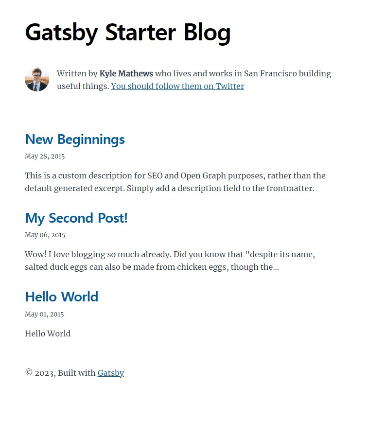

안녕하세요! 드디어 저의 깃허브 블로그 첫 포스팅입니다✨

개발을 하면서 가장 중요하게 해 나가야 할 것 중 하나가 **기록**이 아닐까 싶은데요!<br/>
저는 그동안 이런저런 블로그(velog, notion 등..)들을 전전하면서 항상 구조, 테마 등의 아쉬움이 있었습니다.

그러다가 직접 나만의 블로그를 만들어보자! 해서 여기까지 왔습니다ㅎㅎㅎ<br/>
(심지어 깃허브를 통해 배포하는 거라, 제 잔디까지 심고 일석이조?😆)

## What's Gatsby?

우선! Gatsby가 무엇일까요? 

>💡 Gatsby는 프론트엔드 라이브러리 React를 기반으로 하는 JAM Stack 기반의 정적 사이트 생성 프레임워크 입니다.

## JAM Stack?

JAM Stack의 JAM은 `Javascript`, `Api`, `Markup`의 약자입니다.


**즉, Javascript & Markup으로 정적 페이지를 표시하고, 필요 시에 API를 통해 데이터를 호출하는 것입니다.**

- 전통적 웹 사이트: 서버에 요청하면 SSR을 통해 HTML을 만들어 제공
- SPA: 처음 요청받은 페이지만 SSR로 제공하고 나머지는 CSR로 제공
- JAM Stack: 각 페이지를 HTML로 Pre-Render하여 캐싱 후 CDN에서 제공

> #### Javascript
> Client의 모든 처리는 Javascript에 맞긴다.
> #### API
> 모든 기능 및 비즈니스 로직은 재사용 가능한 API로 추상화한다.
> #### Markup
> SSG (Static Site Generator)나 Template Engine(Webpack 등)을 이용하여 Markup을 미리 생성한다.

여기서 제일 중요한 부분이 `Markup`입니다.

### Markup

Markup을 만들 수 있는 방법은 매우 다양한데, 

HTML을 직접 작성하거나, [Template Engine](https://en.wikipedia.org/wiki/Comparison_of_web_template_engines) 같은 툴을 이용하거나,
`Jekyll (ruby)`, `Hugo (go)`, `Nuxt (vue)`, `Next (react)`, `Gatsby` 같은 **정적 사이트 생성기 (Static Site Generator, SSG)** 를 이용해서, 
**Static HTML**을 생성할 수도 있습니다.

그리고 미리 작성된 **Static HTML**은 웹서버의 리소스를 쓸 필요 없이, 사용자에게 HTML만을 전달해주면 됩니다.

이는 매우 큰 장점을 가져오게 되는데, Static HTML을 CDN을 통해 Cache하고 배포하여, 빠른 속도를 유지합니다.

따로 동적으로 HTML을 생성하지 않기 때문에, 따로 웹서버가 필요 없어 서버 비용이 높지 않습니다.

> 자 그럼, 마크업은 뭘로 하는게 좋을까? 고민하신다면,
> - 원페이지, 위키, 블로그 등 정적 콘텐츠가 대부분이고 볼륨이 가볍다 ? => `Gatsby`
> - 동적 데이터 활용도가 많고 컨텐츠 양이 점점 많아질 것으로 예상된다 ? => `Next.js`
> 저는 이러한 이유로 개츠비를 선택하게 되었습니다. 🙌


---

## 다뤄보기

### 프로젝트 생성
요구조건: `Node.js 18.0.0+`

node 버전은 18 이상이어야 합니다. 저는 회사에서 버전 16을 사용하고 있었기 때문에, 버전을 변경해주어야 했습니다.
`nvm`을 이용하면 노드 버전을 스위칭하여 사용할 수 있습니다.

**nvm(node version manager): 여러개의 노드 버전을 사용할 수있는 도구**

```shell
$ nvm list  # 사용가능한 node 버전 리스트 확인

    18.16.0
    18.15.0 
    16.18.1
  * 16.17.1 (Currently using 64-bit executable)
    14.16.0

# 원하는 버전이 없다면 설치
$ nvm install {원하는 버전}

# 원하는 버전으로 변경
$ nvm use {원하는 버전}

# 변경된 노드 버전 확인
$ node -v 
v18.15.0
```

자 이제 노드 버전을 변경해 줬으니, 본격적으로 개츠비를 설치해봅시다!

### 설치

```shell
$ npm install -g gatsby-cli
```

### 테마 선택하기

[Gatsby Starter](https://www.gatsbyjs.com/starters/) 사이트에 다양한 테마들이 있는데요!
저는 [gatsby-starter-blog](https://www.gatsbyjs.com/starters/gatsbyjs/gatsby-starter-blog/) 테마를 선택했습니다.<br/>
gatsby 명령어를 사용하여 blog라는 디렉토리에 블로그의 소스코드를 가져옵니다.

```shell
$ gatsby new blog https://github.com/gatsbyjs/gatsby-starter-blog
```

설치가 완료되면 현재 위치에 blog라는 디렉토리가 생성되고, 이 안에 각종 파일이 생성됩니다.


```shell
$ cd blog # 생성된 디렉토리로 들어가서,

$ npm develop # 로컬 서버를 띄워준다.
```

이제 브라우저(chrome)을 열고 주소창에 localhost:8000으로 접속해보세요.<br/>
아래와 같은 화면이 뜨면 성공입니다! 🎉




### Gatsby Blog 기본 세팅하기

이제 복사해온 사이트의 정보를 저의 정보로 수정해 봅시다.

`gatsby-config.js` - 블로그와 관련된 설정을 하는 파일


```js
module.exports = {
    siteMetadata: {
        title: `Kirahaa`,
        author: {
            name: `Hayeong Kim`,
            summary: `I believe the importance of experience`,
        },
        description: `kirahaa blog`,
        siteUrl: `https://kirahaa.github.io/`,
    },
// ...
}
```


`package.json` - 프로젝트 정보 수정

package.json 파일 내에 기본 정보들을 수정해주고,
"scripts" 내에 **deploy** 명령어를 추가해서 다음과 같이 적어주세요.

```json
{
  "name": "kirahaa-blog",
  "private": false,
  "description": "kirahaa blog",
  "version": "0.1.0",
  "author": "Hayeong Kim <khy4018@gmail.com>",
  "bugs": {
    "url": "https://github.com/kirahaa/kirahaa.github.io/issues"
  },
  // ...
  "scripts": {
    "deploy": "gatsby build && gh-pages -d public -b master"
  }
}
```


앞으로 포스팅 작성을 완료하고, 로컬에서 잘 확인했으면 `npm run deploy` 명령어로 배포합니다.

이때 소스코드 빌드 후의 public 폴더를 github master 브랜치에 push한다는 뜻이고, 이 소스 코드로 [https://kirahaa.github.io/](https://kirahaa.github.io/)에 배포됩니다.

### github.io repo 만들기

이제 자신의 github에 소스코드를 올리면 됩니다!

github에 접속해서 새로운 repository(이하 repo)를 만들어주세요. 그런데 repo 이름에 유의하셔야 합니다!<br/>
github의 **usename** 뒤에 **.github.io**을 붙여서 만들어주세요. 제 **github username**은 kirahaa이기 때문에
`kirahaa.github.io`로 만들었습니다. <br/> 
공개범위는 **Public**으로 만들어주세요😉

### 배포하기


먼저, 저희는 `gh-pages`로 배포할 것이기 때문에 gh-pages package를 설치해줍니다.

```shell
$ npm install gh-pages --save-dev
```

이제 로컬에 있는 블로그 소스코드를 github에 올려봅시다!

블로그 root에서 git을 세팅합니다. 

```shell
$ git init
$ git remote add origin https://github.com/kirahaa/kirahaa.github.io.git
```

다음 명령어로 origin 주소가 잘 연결되었는지 확인해 줍니다.
```shell
$ git remote -v
```

푸시를 해줍니다.
```shell
$ git add .
$ git commit -m "first commit"
$ git push origin master
```

github에서 소스코드가 잘 올라갔는지 확인해 주세요.

잘 됐으면 배포 명령어를 실행합니다. 

```shell
$ npm run deploy
```

정상적으로 배포가 되었다면, github 사이트의 블로그 repo에 가서 master에 올라온 소스코드를 확인해 주세요.<br/>
저희가 원래 받았던 소스코드와 구조가 완전히 다르죠?! 여기서 놀라지 마시구,, 😁

해당 소스는 포스팅을 작성하고 커스터마이징 할 수 있는 개발 소스가 아니라 블로그 사이트에 배포될 수 있도록 .md 파일이 모두 html, js로 바뀐 빌드된 파일입니다.

`npm run deploy` 명령어가 알아서 build도 해주고, git의 master 브랜치에 push도 해주고 배포도 해준 것입니다.

앞으로 항상 deploy만 해줘도 되지만, 다른 컴퓨터에서 포스팅을 작성할 경우를 대비하여 개발코드도 저장해주도록 합시다!<br/>
develop이라는 브랜치를 따로 만들어서 여기에다만 올리도록 하겠습니다.


```shell
$ git branch develop  # develop 브랜치 생성

$ git checkout develop  # develop 브랜치로 체크아웃
```

동일하게 소스코드를 git에 push해 줍니다.

```shell
$ git add .
$ git commit -m "blog posting~"
$ git push -u origin develop
```

내 github의 develop repo에 들어가서 소스코드가 모두 잘 올라갔는지 확인해 주세요.

잘 올라갔다면 github default 브랜치를 develop으로 바꾸겠습니다.<br/>
어차피 빌드 결과물인 master 브랜치의 빌드 파일들을 파악할 필요도 없으니까요.<br/>
github의 해당 블로그 repo에 들어가서 **Setting > Branches** 메뉴에서 Default branch를 devleop으로 바꾸고 update 버튼을 눌러주세요!

이제 각자의 **username.github.io**에 들어가서 배포된 블로그를 확인해 보세요!

<br/>

여기까지, 가장 기본적인 블로그 세팅이 끝났습니다!<br/>
다음 포스팅에서는 **개츠비 플러그인을 사용해 블로그 커스텀하는 법**을 더 자세히 살펴보겠습니다!

다음 포스팅도 기대해주세욧 😉✨

<br/>

---

#### 참고 자료

- https://anneslab.tistory.com/116
- https://yeri-kim.github.io/posts/how-to-install-gatsby/
- https://uzzam.dev/6
- https://pks2974.medium.com/jam-stack-%EA%B0%9C%EB%85%90-%EC%A0%95%EB%A6%AC%ED%95%98%EA%B8%B0-17dd5c34edf7