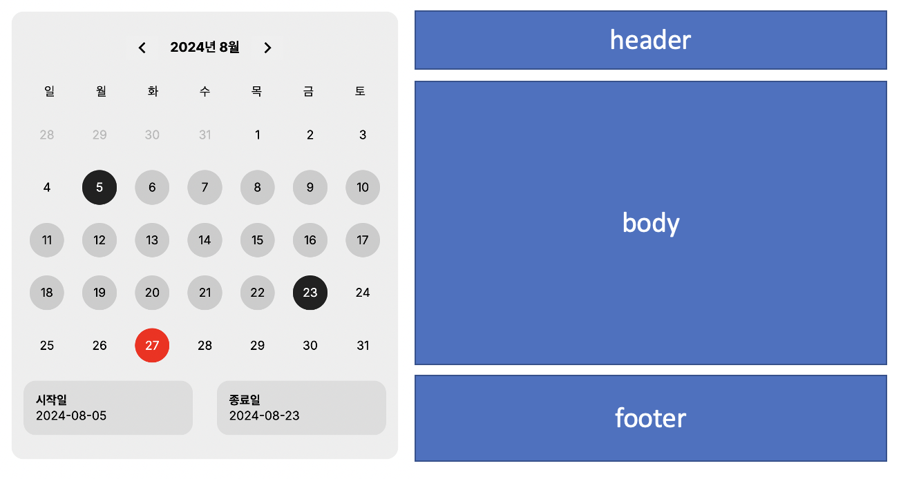
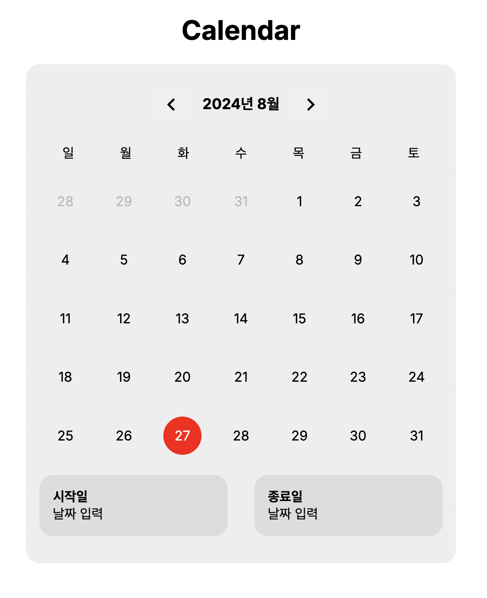

얼마전 기업 기술 과제로 캘린더 컴포넌트를 만들었던 경험이 있었는데,
만들면서 꽤나 배운 점들이 많아서 기록해 보려고 합니다.

한 번 만들어봤다고 해도, 따로 정리나 기록을 해놓지 않으면 나중에 생각했을 때 남는 점이 없는 것 같아요.
(만든지 일주일됐는데 벌써 가물가물한 1인..😮‍💨)

그런 의미에서 나중의 '나 자신'을 위해 잘 기록해 보려고 합니다. 레츠꼬~!

---

## 요구사항

캘린더 컴포넌트 구현의 요구 사항은 다음과 같았습니다.

> 이 컴포넌트는 사용자가 시작일과 종료일을 선택하고, 선택한 날짜를 표시할 수 있는 기능을 포함합니다.
> 
> - 캘린더는 전달과 다음달로만 이동할 수 있어야 합니다.
> - 사용자는 캘린더에서 두 개의 날짜를 선택할 수 있어야 합니다.
> - 사용자가 선택한 두 날짜를 별도로 표시하는 영역이 있어야 합니다.

전달과 다음달로만 이동할 수 있어야 한다는 요구사항이 있어서 오히려 다행이라고 느껴졌어요ㅎㅎ
만약 다른 달을 선택할 수 있도록 해야하면 추가 로직이 필요해질테니까요..!


### 컴포넌트 구조

먼저 캘린더의 컴포넌트 구조를 기능별로 나누어 다음과 같이 구성해보았습니다.



**Header**: 해당 년도와 달 표시, 전달과 다음달로 이동할 수 있는 버튼

**Body**: 날짜를 선택할 수 있는 영역

**Footer**: 선택된 날짜가 표시되는 영역


```
// components/Calendar/index.tsx
const Calendar = () => {
  const {
    currentDate,
    currentMonthDates,
    todayDate,
    startDate,
    setStartDate,
    endDate,
    setEndDate,
    prevMonth,
    nextMonth,
    prevMonthDates,
    nextMonthDates
  } = useCalendar()

  return (
    <CalendarCell>
      <CalendarHeader
        currentMonth={currentDate}
        prevMonth={prevMonth}
        nextMonth={nextMonth}
      />
      <CalendarBody
        currentMonthDates={currentMonthDates()}
        prevMonthDates={prevMonthDates()}
        nextMonthDates={nextMonthDates()}
        todayDate={todayDate()}
        startDate={startDate}
        setStartDate={setStartDate}
        endDate={endDate}
        setEndDate={setEndDate}
      />
      <CalendarFooter
        startDate={startDate}
        endDate={endDate}
      />
    </CalendarCell>
  )
}
export default Calendar;
```

미리 스포를 해보자면, 최종 캘린더 컴포넌트 구조는 위와 같습니다.

데이터와 UI적인 요소를 분리하기 위해 데이터 관련 로직은 useCalendar 훅을 만들었습니다.

### 날짜 라이브러리 date-fns

date-fns는 Javascript와 Typescript는 날짜 관련 유틸리티 라이브러리입니다.
날짜를 다루는 다양한 함수들을 제공하여 날짜 및 시간 관련 작업을 쉽게 처리할 수 있도록 도와주는 라이브러리라고 하네요.
구현 과정에서 유틸리티성 라이브러리는 자유롭게 사용이 가능하다하여 빠른 작업을 위해 date-fns 라이브러리를 사용해 주었습니다.

### 구현

캘린더는 아래의 기준으로 구현하였습니다.

1. 일요일이 첫 번째 요일로 시작한다.
2. 캘린더가 꽉 찰 수 있도록 전달의 마지막 주의 날짜와 다음달의 첫 번째 주의 날짜도 표시한다.

이를 구현하기 위해서 date-fns에서 다음의 메서드들을 가져와 사용하였습니다.

#### format()

`format()` 함수를 사용하여 날짜 및 시간을 원하는 형태의 문자열로 변경할 수 있습니다.
```
import { format } from "date-fns"

let date = new Date();
console.log(date); // Tue Aug 15 2023 00:00:00 GMT+0900 (한국 표준시)
console.log(format(date, "yyyy-MM-d")) // 2023-08-15
console.log(format(date, "yyyy/MM/d")) // 2023/08/15
console.log(format(date, "Y")) // 2023
console.log(format(date, "M")) // 8
console.log(format(date, "d")) // 15
```

저는 현재 달의 년도와 월을 가져오기 위해 다음과 같이 사용해주었습니다.
```
const CalendarHeader = ({
    currentMonth,
    prevMonth,
    nextMonth
  }: CalendarHeaderProps ) => {
  return (
    <HeaderCell>
      <button onClick={prevMonth}><MdKeyboardArrowLeft size={30}/></button>
      <span>
        {format(currentMonth, "yyyy")}년{' '}
        {format(currentMonth, "M")}월
      </span>
      <button onClick={nextMonth}><MdKeyboardArrowRight size={30}/></button>
    </HeaderCell>
  )
}
export default CalendarHeader;
```


#### subMonths(), addMonths()
주어진 날짜를 기준으로 연도나 월을 증감시켜주기 위해 subMonths(), addMonths() 메서드를 사용하였습니다.

```
const [currentDate, setCurrentDate] = useState(new Date())

const prevMonth = () => {
    setCurrentDate(subMonths(currentDate, 1))
}
const nextMonth = () => {
    setCurrentDate(addMonths(currentDate, 1))
}
```

#### getYear(), getMonth()
해당 달의 첫째 날과 마지막 날을 가져오기 위해 사용하였습니다.
이는 달력에 표시할 날짜 범위를 정하는 데 사용됩니다.

```
const firstDayOfMonth = () => {
    return new Date(getYear(currentDate), getMonth(currentDate, 1)
}

const lastDayOfMonth = () => {
    return new Date(getYear(currentDate), getMonth(currentDate) + 1, 0)
}
```

#### eachDayOfInterval()
달력에 날짜를 표시하기 위해 계산한 기간 동안의 모든 날짜를 배열로 가져오기 위해 사용하였습니다.
```
const currentMonthDates = () => {
    return eachDayOfInterval({
        start: firstDayOfMonth(),
        end: lastDayOfMonth()
    })
}
```

#### startOfWeek(), subDays(), addDays(), endOfWeek()
주어진 날짜를 기준으로 전달과 다음달의 날짜를 배열로 가져오기 위해 사용하였습니다.
```
const prevMonthDates = () => {
    const startDate = startOfWeek(firstDayOfMonth())
    const endDate = subDays(firstDayOfMonth(), 1)
    
    if (startDate > endDate) {
        return []
    }
    
    return eachDayOfInterval({
        start: startDate,
        end: endDate
    })
}

const NextMonthDates = () => {
    const startDate = addDays(lastDayOfMonth(), 1)
    const endDate = endOfWeek(lasyDayOfMonth())
    
    if (startDate > endDate) {
        return []
    }
    
    return eachDayOfInterval({
        start: startDate, 
        end: endDate
    })
}
```

#### view 구현

메서드를 조합하여 `useCalendar` 훅으로 만들고 구현하였습니다.


```
// CalendarBody 컴포넌트

const DAYS = ['일', '월', '화', '수', '목', '금', '토'];

const CalendarBody = (
  {
    currentMonthDates,
    prevMonthDates,
    nextMonthDates,
    todayDate,
    startDate,
    setStartDate,
    endDate,
    setEndDate
  }: DateGridProps ) => {

  const handleDateClick = (date: Date) => {
    if (!startDate || (startDate && endDate)) {
      setStartDate(date)
      setEndDate(null)
    } else {
      if (isBefore(date, startDate)) {
        setStartDate(date)
        setEndDate(null)
      } else {
        setEndDate(date)
      }
    }
  }

  const isDateInRange = (date: Date) => {
    if (!startDate || !endDate) return false
    return isBefore(date, endDate) && isAfter(date, startDate)
  }

  const isStartDate = (date: Date) => startDate && isSameDay(date, startDate)
  const isEndDate = (date: Date) => endDate && isSameDay(date, endDate)

  return (
    <BodyCell>
      <DaysCell>
        {DAYS.map((day) => (
          <DayCell key={day}>{day}</DayCell>
        ))}
      </DaysCell>
      <DatesCell>
        {prevMonthDates.map((prevDate) => (
          <DateCell
            key={prevDate.toString()}
            notCurrentMonth
            isInRange={isDateInRange(prevDate)}
            isStartDate={isStartDate(prevDate)}
            isEndDate={isEndDate(prevDate)}
            onClick={() => handleDateClick(prevDate)}
          >
            {getDate(prevDate)}
          </DateCell>
        ))}
        {currentMonthDates.map((currentDate) => (
          <DateCell
            key={currentDate.toString()}
            isToday={isSameDay(currentDate, todayDate)}
            isInRange={isDateInRange(currentDate)}
            isStartDate={isStartDate(currentDate)}
            isEndDate={isEndDate(currentDate)}
            onClick={() => handleDateClick(currentDate)}
          >
            {getDate(currentDate)}
          </DateCell>
        ))}
        {nextMonthDates.map((nextDate) => (
          <DateCell
            key={nextDate.toString()}
            notCurrentMonth
            isInRange={isDateInRange(nextDate)}
            isStartDate={isStartDate(nextDate)}
            isEndDate={isEndDate(nextDate)}
            onClick={() => handleDateClick(nextDate)}
          >
            {getDate(nextDate)}
          </DateCell>
        ))}
      </DatesCell>
    </BodyCell>
  )
}
export default CalendarBody;
```

시작일(startDate)과 종료일(endDate)도 `useCalendar` 훅에 넣어 공통으로 관리해주었습니다.

```
export default function useCalendar() {
  const [startDate, setStartDate] = useState<null | Date>(null)
  const [endDate, setEndDate] = useState<null | Date>(null)
  ...
}
```

```
const CalendarFooter = (
  {
    startDate,
    endDate
  }) => {
  return (
    <FooterCell>
      <DateCell>
        <dt>시작일</dt>
        <dd>{startDate ? format(startDate, 'yyyy-MM-dd') : '날짜 입력'}</dd>
      </DateCell>
      <DateCell>
        <dt>종료일</dt>
        <dd>{endDate ? format(endDate, 'yyyy-MM-dd') : '날짜 입력'}</dd>
      </DateCell>
    </FooterCell>
  )
}
export default CalendarFooter;
```

### 마무리

다행히 date-fns가 여러 편리한 함수를 제공해줘서 단순히 이를 잘 활용하기만 하면 돼서 생각보다 금방 만들 수 있었습니다.

간단하지만 오랜만에 제대로 된 컴포넌트를 만들어 본 것이었는데, 너무 즐거운 작업이었습니다~!

특히 처음으로 Next.js + Typescript 환경에서 작업해봤는데, 다행히 복잡한 작업은 아니라 큰 어려움은 없었습니다.<br/>
누군가에게 도움이 되는 글이었길 바라며, 문의사항이 있으시다면 댓글 부탁드려요😊