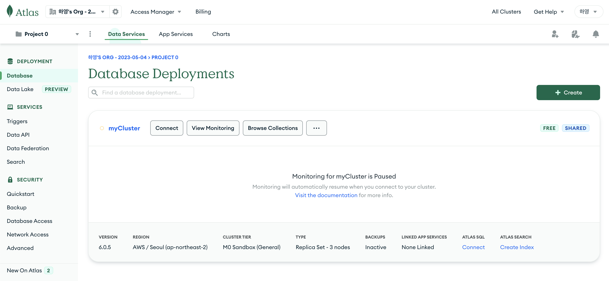
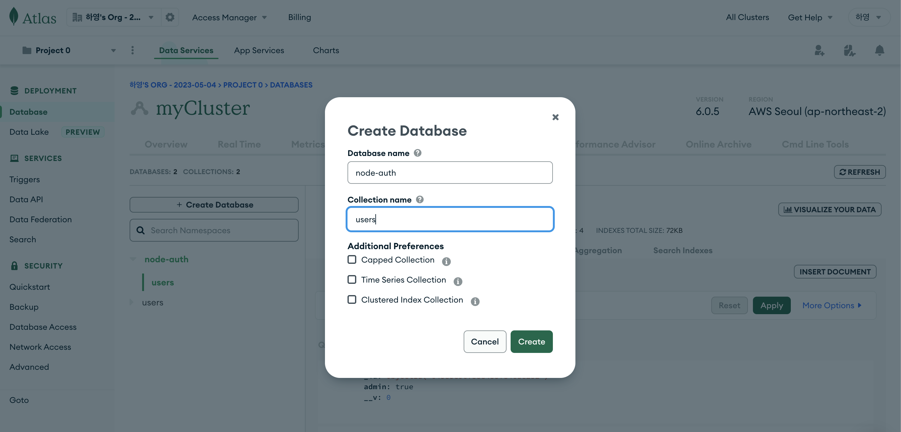
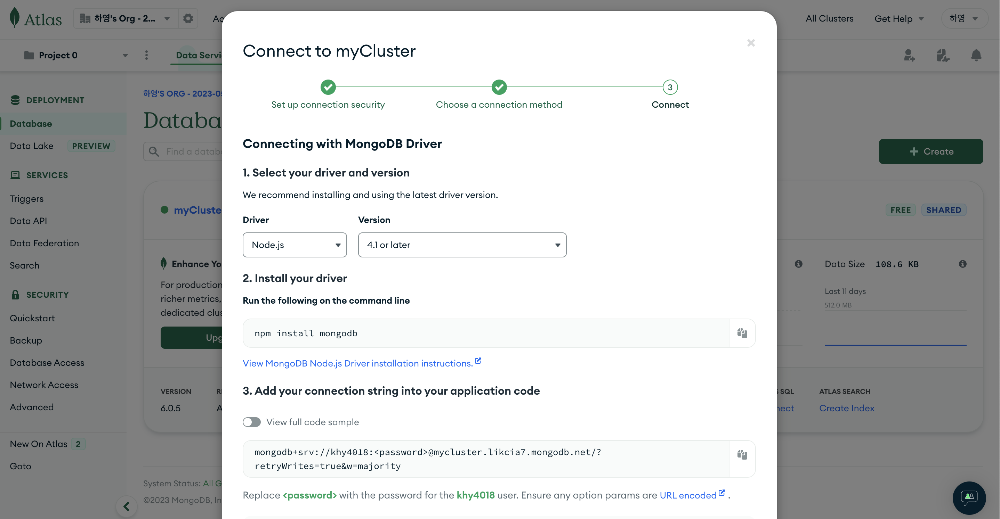
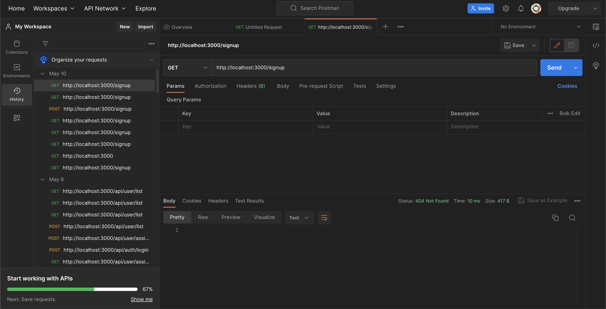
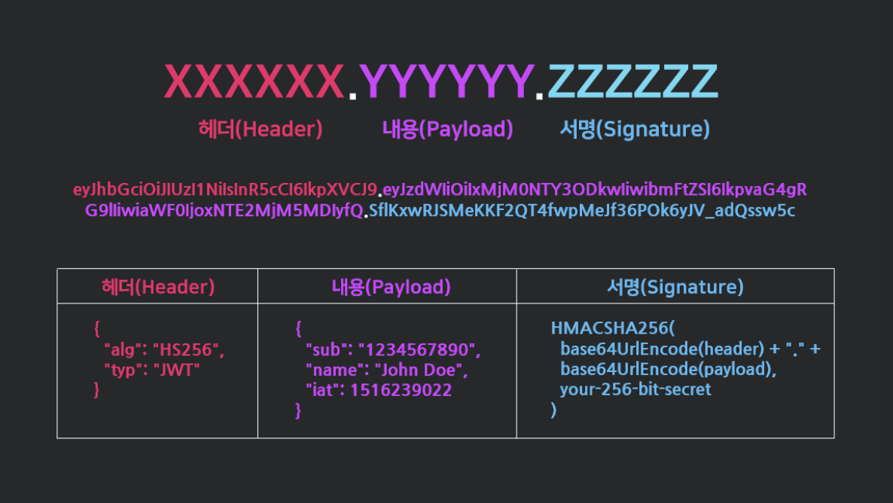

> Node.js와 Express, Mongodb를 이용한 JWT 토큰 기반 인증 시스템을 구현 한 뒤, AWS ec2를 통해 배포한 내용을 정리하였습니다.

---

## 1. 프로젝트 생성 및 설정하기

새로운 디렉토리를 만든 후, package.json 파일을 다음과 같이 설정해주고, `npm install` 명령어를 통해 프로젝트에 필요한 모듈을 설치해 줍니다.

```json
// package.json
{
  "name": "express-jwt-auth",
  "version": "1.0.0",
  "description": "auth with express jwt",
  "main": "index.js",
  "dependencies": {
    "bcrypt": "^5.0.0",
    "cookie-parser": "^1.4.5",
    "ejs": "^3.1.3",
    "express": "^4.17.1",
    "jsonwebtoken": "^8.5.1",
    "mongoose": "^5.9.23",
    "validator": "^13.1.1"
  },
  "scripts": {
    "start": "node app.js",
    "test": "echo \"Error: no test specified\" && exit 1"
  },
  "keywords": [
    "auth",
    "express",
    "jwt"
  ],
  "author": "hayeong",
  "license": "ISC"
}
```

### 디렉토리 구조

프로젝트에서 사용할 디렉토리 구조는 다음과 같습니다.
페이지 템플릿은 `ejs`를 사용하였습니다.

```
├─ .gitignore
├─ README.md
├─ app.js
├─ config.example.js
├─ controllers
│  └─ authController.js
├─ middleware
│  └─ authMiddleware.js
├─ models
│  └─ User.js
├─ package.json
├─ public
│  └─ style.css
├─ routes
│  └─ authRoutes.js
└─ views
   ├─ detail.ejs
   ├─ home.ejs
   ├─ login.ejs
   ├─ partials
   │  ├─ footer.ejs
   │  └─ header.ejs
   └─ signup.ejs
```
©generated by [Project Tree Generator](https://woochanleee.github.io/project-tree-generator)

### app.js 세팅하기

```js
// app.js
const express = require('express');
const mongoose = require('mongoose');

const config = require('./config')

const app = express();

// middleware
app.use(express.static('public'));

// view engine
app.set('view engine', 'ejs');

mongoose.connect(config.mongodbUri)
const db = mongoose.connection
db.on('error', console.error)
db.once('open', ()=>{
    console.log('connected to mongodb server')
    app.listen(3000)
})

// routes
app.get('/', (req, res) => res.render('home'));
```

`config.js` 파일은 프로젝트에서 사용할 MongoDB 서버의 정보와, JWT 토큰을 만들 때 사용될 `secret` 키의 정보를 지니고 있습니다.

보안에 관련된 정보는 따로 파일에 분리하여 관리하는 것이 좋습니다.
github 저장소에도 `config.js` 파일은 `.gitignore`에 추가해서 커밋이 되지 않도록 설정합니다.
예제 정보가 적혀있는 `config.example.js` 파일의 이름을 `config.js`로 수정하고 사용합니다.
설정 파일을 작성하기 전에, MongoDB 서버를 만들어 봅시다.

## 2. MongoDB 준비

[MongoDB 홈페이지](https://www.mongodb.com/)에 들어가서 회원가입을 해 줍니다.<br/>
새로운 프로젝트를 만들고 새로운 클러스터를 만듭니다.



저는 `Project 0`의 `myCluster`란 이름의 클러스터를 만들어 주었습니다.

### 데이터 베이스 만들기

**Browse Collections > add my own data**에서 새로운 데이터 베이스를 생성합니다.



저는 데이터 베이스 이름을 `node-auth`로 설정하고, collection 이름을 `users`로 설정하였습니다.<br/>
설정이 끝나면 **Connect > Connect to your application > Drivers** 해당 데이터 베이스에 연결하면 하단에 **application code**가 나옵니다.



> **application code 예시**
>
> mongodb+srv://<본인 아이디>:<패스워드>@mycluster.likcia7.mongodb.net/?retryWrites=true&w=majority

## 3. MongoDB 연결하기

### config.js 세팅하기

위에서 생성한 **application code**를 복사 붙여넣기 해 줍니다.

```js
module.exports = {
  'secret': 'SeCrEtKeYfOrHaShInG',
  'mongodbUri': 'mongodb+srv://<본인 아이디>:<패스워드>@mycluster.likcia7.mongodb.net/?retryWrites=true&w=majority'
}
```

`secret` 키는 이후에 JWT 토큰을 검증하는 서명 부분에 사용할 비밀 키입니다. 보안에 연관된 정보들은 config.js 파일에 보관해 줍니다.

여기까지 코드작성이 완료되었다면, 터미널에서 `node app.js`를 입력하여 서버를 실행할 수 있습니다.

```shell
> node app.js

connected to mongodb server // 이렇게 뜨면 성공! 🎉
```

## 4. 본격 API 만들기

### Auth Routes

인증에 관련된 라우터를 구성해 줍니다.

| route       | request |                 description |
|:------------|:--------|----------------------------:|
| **/signup** | GET     |                sign up page |
| **/login**  | GET     |                  login page |
| **/signup** | POST    |     create a new user in db |
| **/login**  | POST    | authenticate a current user |
| **/logout** | GET     |                 logout page |

`authRoutes.js` 파일을 생성한 후, 다음과 같이 라우터를 설정해 줍니다.

```js
// routes/authRoutes.js
const { Router } = require('express');

const router = Router();

router.get('/signup', () => {});
router.post('/signup', () => {});
router.get('/login', () => {});
router.post('/login', () => {});
router.get('/logout', () => {})

module.exports = router;
```

### 컨트롤러

이제 각각의 기능을 구현할 컨트롤러를 만들어 줍니다.

```js
// controllers/authController.js

module.exports.signup_get = (req, res) => {
	res.render('signup')
}

module.exports.login_get = (req, res) => {
	res.render('login')
}

module.exports.signup_post = (req, res) => {
	res.send('new signup')
}

module.exports.login_post = (req, res) => {
	res.send('user login')
}
```

구성한 컨트롤러를 router에 연결합니다.

```js
// routes/authRoutes.js

const {Router} = require('express');
const authController = require('../controllers/authController');

const router = Router();

router.get('/signup', authController.signup_get);
router.post('/signup', authController.signup_post);
router.get('/login', () => authController.login_get);
router.post('/login', () => authController.login_post);


module.exports = router;
```

`app.js`에도 이 라우터들을 연결해 줍니다.

```js
...
const authRoutes = require('./routes/authRoutes');
...

app.use(authRoutes);
```

## 5. Postman을 이용한 API 테스트

[Postman](https://www.postman.com/)은 프론트엔드가 구현되기 전에 서버에 대한 요청을 시뮬레이션할 수 있는 플랫폼입니다.<br/>
이를 통해 개발한 API를 테스트하고, 테스트 결과를 공유하여 API 개발의 생산성을 높일 수 있습니다.



Postman을 통해 생성한 api 주소로 각 요청을 보내 연결이 잘 되는지 확인할 수 있습니다.

## 6. model

`mongoose`를 통해 유저 정보를 MongoDB에 넣을때, 스키마를 만들어야 합니다.<br/>
스키마란 기본적으로 데이터베이스에서 사용자 데이터나 기록이 어떻게 표시되어야 하는지를 정의합니다.<br/>
해당 파트에서 유효성 문구 등을 직접 설정할 수 있습니다.

```js
// models/User.js

const mongoose = require('mongoose');
const { isEmail } = require('validator');

const userSchema = new mongoose.Schema({
	email: {
		type: String,
		required: [true, 'Please enter an email'],
		unique: true,
		lowercase: true,
		validate: [isEmail, 'Please enter a valid email']
	},
	password: {
		type: String,
		required: [true, 'Please enter a password'],
		minlength: [6, 'Minimum password length is 6 characters']
	},
});

const User = mongoose.model('user', userSchema);

module.exports = User;
```

다시 컨트롤러로 돌아가서 유저 모델을 연결해 줍니다.

```js
// controllers/authController.js
const User = require('../models/User');

// handle errors
const handleErrors = (err) => {
	console.log(err.message, err.code);
	let error = { email: '', password: ''};

	// duplicate error code
	if (err.code === 11000) {
		errors.email = 'that email is aleady registered';
		return errors;
	}

	// validation errors
	if (err.message.includes('user validation failed')) {
		Object.values(err.errors).forEach(({properties}) => {
			error[properties.path] = properties.message;
		})
	}

	return errors;
}

module.exports.signup_get = (req, res) => {
	res.render('signup')
}

module.exports.login_get = (req, res) => {
	res.render('login')
}

module.exports.signup_post = async (req, res) => {
	const {email, password} = req.body;

	try {
		const user = await User.create({ email, password }); // 유저 생성
		res.status(201).json(user);
	}
	catch (err) {
		const errors = handleErrors(err);
		res.status(400).json({errors})
	}
}

module.exports.login_post = async (req, res) => {
	const {email, password} = req.body;

	console.log(email, password);
	res.send('user login')
}
```


### 비밀번호 해시처리
현재 유저정보가 DB에 잘 쌓이고 있는데, 비밀번호가 그대로 드러나고 있습니다.<br/>
이를 방지하기 위해, `bcrypt` 라이브러리를 사용하여 비밀번호를 암호화 시켜줍니다.

```js
// User.js

const mongoose = require('mongoose');
const { isEmail } = require('validator');
const bcrypt = require('bcrypt');

const userSchema = new mongoose.Schema({
	email: {
		type: String,
		required: [true, 'Please enter an email'],
		unique: true,
		lowercase: true,
		validate: [isEmail, 'Please enter a valid email']
	},
	password: {
		type: String,
		required: [true, 'Please enter a password'],
		minlength: [6, 'Minimum password length is 6 characters']
	},
});

// fire a function before doc saved to db
userSchema.pre('save', async function (next) {
	const salt = await bcrypt.genSalt();
	this.password = await bcrypt.hash(this.password, salt);
	
	next();
})

const User = mongoose.model('user', userSchema);

module.exports = User;
```

데이터가 저장되기 전에(`pre`) 비밀번호를 해시 처리해서 암호화 시켜줍니다.

### Cookies

쿠키는 클라이언트 개개인의 상태 정보를 담고 있는 데이터입니다.<br/>
다음과 같은 방법으로 브라우저에 쿠키를 생성할 수 있습니다.

```js
// app.js

// cookies
app.get('/set-cookies', (req, res) => {
	res.setHeader('Set-Cookie', 'newUser=true');
	// 또는
	res.cookie('newUser', false);
	
	res.send('you got the cookies!');
});
```

> 💡 여기서 주의할 점!
> 
> 쿠키는 javascript의 document.cookie를 통해 접근할 수 있기 때문에, 해킹 당할 위험이 있다.
> 이를 보호하기 위해 HttOnly나 Secure 속성을 설정할 수 있다.


```js
res.cookie('test', true, { httpOnly: true })
```

이렇게 httpOnly 옵션을 추가하면, 클라이언트의 환경(웹 브라우저)에서 스크립트(javascript 등)로 쿠키에 접근하는 것을 차단할 수 있다. 이 설정을 함으로써 XSS(Cross Site Script) 공격에 대응이 가능하다.

추가로, 쿠키의 만료날짜를 설정할 수 있습니다.

```js
const maxAge = 60 * 60 * 24 * 2;  // 60초 * 60분 * 24시간 * 2일

res.cookie('jwt', token, { httpOnly: true, maxAge: maxAge * 1000 })
```


## 7. JSON Web Tokens

JWT(JSON Web Token)란 **인증에 필요한 정보들을 암호화시킨 JSON 토큰**을 의미합니다.<br/>
그리고 JWT 기반 인증은 JWT 토큰(Access Token)을 HTTP 헤더에 실어 서버가 클라이언트를 식별하는 방식입니다.<br/>
JWT는 .을 구분자로 나누어지는 세 가지 문자열의 조합입니다.<br/>
.을 기준으로 `Header`, `Payload`, `Signature`로 구성되어 있습니다.



`Header` 에는 JWT 에서 사용할 타입과 해시 알고리즘의 종류가 담겨있으며, `Payload` 는 서버에서 첨부한 사용자 권한 정보와 데이터가 담겨있습니다. `Signature`에는 Header, Payload 를 Base64 URL-safe Encode를 한 이후 Header에 명시된 해시함수를 적용하고, 개인키(Private Key)로 서명한 전자서명이 담겨있습니다.

```js
// controllers/authController.js
...
const jwt = require('jsonwebtoken');
...

const maxAge = 3 * 24 * 60 * 60;  // three days
const createToken = (id) => {
	return jwt.sign({ id }, config.secret, {
		expiresIn: maxAge
	});
} 

...

module.exports.signup_post = async (req, res) => {
	const {email, password} = req.body;

	try {
		const user = await User.create({ email, password });
		const token = createToken(user._id);
		res.cookie('jwt', token, { httpOnly: true, maxAge: maxAge * 1000 })
		res.status(201).json({ user: user._id });
	}
	catch (err) {
		const errors = handleErrors(err);
		res.status(400).json({errors})
	}
}
...
```

### JWT를 이용한 인증 과정

1. 사용자가 ID, PW를 입력하여 서버에 로그인 인증을 요청한다.
2. 서버에서 클라이언트로부터 인증 요청을 받으면, Header, PayLoad, Signature를 정의한다.Hedaer, PayLoad, Signature를 각각 Base64로 한 번 더 암호화하여 JWT를 생성하고 이를 쿠키에 담아 클라이언트에게 발급한다.
3. 클라이언트는 서버로부터 받은 JWT를 로컬 스토리지에 저장한다. (쿠키나 다른 곳에 저장할 수도 있음)API를 서버에 요청할때 **Authorization header에 Access Token을 담아**서 보낸다.
4. 서버가 할 일은 클라이언트가 Header에 담아서 보낸 JWT가 내 서버에서 발행한 토큰인지 일치 여부를 확인하여 일치한다면 인증을 통과시켜주고 아니라면 통과시키지 않으면 된다.인증이 통과되었으므로 페이로드에 들어있는 유저의 정보들을 select해서 클라이언트에 돌려준다.
5. 클라이언트가 서버에 요청을 했는데, 만일 액세스 토큰의 시간이 만료되면 클라이언트는 리프래시 토큰을 이용해서
6. 서버로부터 새로운 엑세스 토큰을 발급 받는다.


### 라우트 보호하기

요청에 jwt가 있는지 확인하고, jwt가 문제가 없는지 확인하는 과정입니다.

```js
// middleware/authMiddleware.js

const jwt = require('jsonwebtoken');

const config = require('../config.js');

const requireAuth = (req, res, next) => {
	const token = req.cookies.jwt;
	
	// check json web token exists & is verified
	if (token) {
		jwt.verify(token, config.secret, (err, decodedToken) => {
			if (err) {
				console.log(err.message);
				res.redirect('/login');
			} else {
				console.log(decodedToken);
				next();
			}
		})
	} else {
		res.redirect('/login');
	}
}

module.exports = { requireAuth }
```

jwt 토큰이 없거나, 유효하지 않은 경우 login 페이지로 넘어가도록 리다이렉트 해 줍니다.

유효한 토큰이 있는 경우에만 접근할 수 있는 페이지에 해당 middleware를 추가합니다.

```js
// app.js

app.get('/home', requireAuth, (req, res) => res.render('home'));
```

## 8. 로그아웃
```js
// AuthController.js

module.exports.logout_get = (req, res) => {
	res.cookie('jwt', '', { maxAge: 1 });
	res.redirect('/');
}
```

로그아웃은 controller에서 jwt라는 키를 가진 쿠키를 지워줍니다. 

### 현재 유저 확인

ejs는 서버로부터 받은 데이터를 가공하여 클라이언트에서 사용할 수 있습니다.

이를 위해 변수를 초기화하는 미들웨어를 작성합니다.

```js
// authMiddleware.js

...

//check current user
const checkUser = (req, res, next) => {
	const token = req.cookies.jwt;
	
	if (token) {
		jwt.verify(token, config.secret, async (err, decodedToken) => {
			if (err) {
				console.log(err.message);
				res.locals.user = null;
				next();
			} else {
				console.log(decodedToken);
				let user = await User.findById(decodedToken.id);
				res.locals.user = user;
				next();
			}
		})
	} else {
		res.locals.user = null;
		next();
	}
}

module.exports = {requireAuth, checkUser};
```

`res.locals.[variable]` 을 통해 클라이언트에 변수를 전달할 수 있습니다.

```js
// app.js
const { requireAuth, checkUser } = require('./middleware/authMiddleware');

...
app.get('*', checkUser); // every single get request
...
```

app.js에 checkUser를 가져와 모든(`*`) get request에서 현재 유저를 확인하는 코드를 추가합니다. 


여기서 생긴 궁금증!

### middleware란 무엇인가?

> middleware의 사전적 정의
> 
> 미들웨어는 양 쪽을 연결하여 데이터를 주고 받을 수 있도록 중간에서 매개 역할을 하는 소프트웨어, 네트워크를 통해서 연결된 여러 개의 컴퓨터에 있는 많은 프로세스들에게 어떤 서비스를 사용할 수 있도록 연결해 주는 소프트웨어를 말한다. 3계층 클라이언트/서버 구조에서 미들웨어가 존재한다. 웹 브라우저에서 데이터베이스로부터 데이터를 저장하거나 읽어올 수 있게 중간에 미들웨어가 존재하게 된다.


광범위한 설명이지만 다음 2개의 키워드가 미들웨어의 역할이라고 생각합니다.

1. 양쪽을 연결
2. 중간에서의 매개 역할

큰 범위로 보면 매개체 간 연결해주는 레이어로써, 매개체는 클라이언트(사용자) - 서버, 서버 - 서버 간의 통신이 될 수도 있습니다.<br/>
통상적으로 기업에서 말하는 미들웨어 환경은 웹/어플리케이션 서버를 의미합니다.

ejs 템플릿을 사용한 프론트 단은 따로 내용에 작성하지 않았습니다.

모든 코드는 [github 레포지토리](https://github.com/kirahaa/auth-with-jwt) 참고 부탁드립니다.


---

여기까지, JWT 인증 시스템 구현이 끝났습니다!<br/>
JWT 인증은 해도 해도 어려운 것 같아요😥 다음에는 REACT 환경에서 JWT 인증을 구현해 보는 것도 도전해 보기로!

다음 포스팅에서는 AWS 프리티어를 이용해서 웹 호스팅 서버를 만드는 과정을 살펴보겠습니다.

가보자고~!💨

---

#### 참고 자료

- https://www.youtube.com/watch?v=SnoAwLP1a-0&list=PL4cUxeGkcC9iqqESP8335DA5cRFp8loyp

- https://velopert.com/2448

- [https://inpa.tistory.com/entry/WEB-📚-JWTjson-web-token-란-💯-정리](https://inpa.tistory.com/entry/WEB-%F0%9F%93%9A-JWTjson-web-token-%EB%9E%80-%F0%9F%92%AF-%EC%A0%95%EB%A6%AC)

- https://www.daleseo.com/js-jwt/