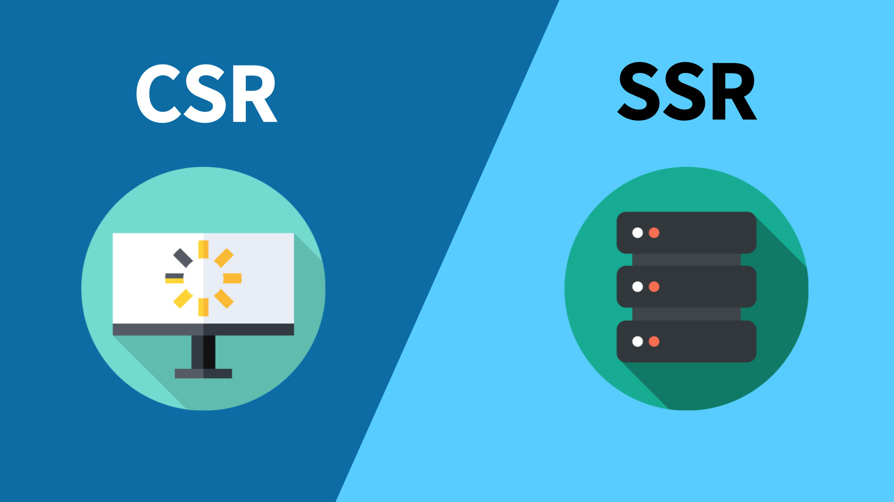

## 브라우저 렌더링?
우선 렌더링이란 **브라우저가 서버로부터 받은 데이터를 브라우저 화면에 표시해주는 작업**입니다. 
즉, 브라우저가 서버로부터 HTML, CSS, Javascript 파일을 전달받고, 브라우저의 렌더링 엔진이 각 파일을 해석해 브라우저 화면을 그려주는 것이죠.

이러한 렌더링 방식은 '클라이언트 사이드 렌더링(CSR)'과 '서버 사이드 렌더링(SSR)'으로 나뉩니다. 
두 방식의 차이점을 간단하게 말하면 **화면을 어디서 그리느냐**입니다.

클라이언트 사이드 렌더링은 '브라우저'에서 그리고, 서버 사이드 렌더링은 '서버'에서 다 그려서 브라우저로 보내줍니다.

### 클라이언트 사이드 렌더링(CSR)

**: 클라이언트인 브라우저가 렌더링을 처리하는 방식** 
서버에서 받은 데이터를 클라이언트인 브라우저가 화면(view)에 그립니다.

- React, Vue, Angular와 같은 프레임워크로 개발한 SPA(Single Page Application)이 클라이언트 사이드 렌더링 방식입니다.
- 브라우저에서 Javascript로 페이지를 렌더링합니다.

모든 JS 파일을 브라우저에서 Javscript로 페이지를 렌더링하기 때문에 사용자의 인터렉션에 빠르게 응답하고, 새로고침이 발생하지 않아 사용자 경험이 좋다는 장점이 있습니다.
다만 서버에 첫 요청 시에 전체 페이지에 대한 모든 파일을 받아야 하므로 첫 페이지 로딩 속도가 느립니다.
그리고 HTML 파일이 거의 비어있기 때문에 검색 엔진에 색인할 내용이 많지 않아 SEO에 불리합니다.

### 서버 사이드 렌더링(SSR)

**: 서버가 렌더링을 처리하는 방식** 
클라이언트가 서버에 데이터를 요청하면, 매번 서버에서 새로운 화면(view)을 그려 제공합니다.

서버 사이드 렌더링은 웹 페이지의 HTML을 서버에서 생성하여 클라이언트로 전송하는 방법입니다.

첫 페이지에 해당하는 문서만 전달하면 되기 때문에, 첫 페이지 로딩 속도가 클라이언트 사이드 렌더링보다 빠릅니다. 
또한, HTML에 모든 컨텐츠가 담겨있기 때문에 SEO에 유리하다는 장점이 있습니다.

다만, 유저가 다른 페이지의 데이터를 요청할 때마다 전체 화면을 서버로부터 다시 받아와야 하므로, 페이지 이동시 속도가 더 느리고, 
새로고침이 일어날 때 화면이 깜빡여 좋지 않은 사용자 경험을 줄 수 있습니다. 
페이지를 이동할 때마다 서버에서 모든 컨텐츠를 HTML을 그려 보내줘야 하기 때문에 사용자가 많아질 수록 서버에 데이터를 요청하는 횟수가 증가해 서버에 과부하가 걸릴 수 있습니다.

