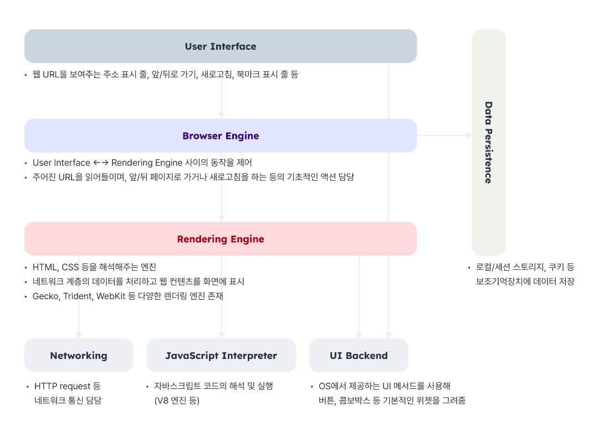
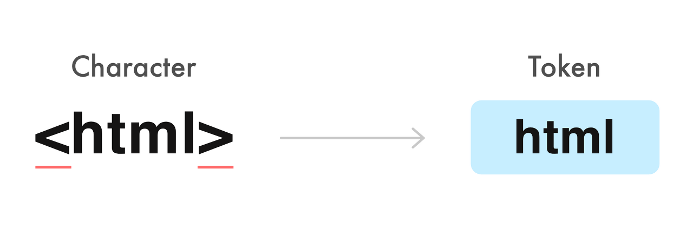
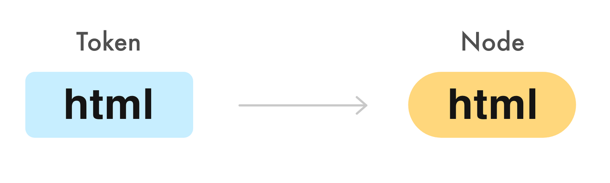
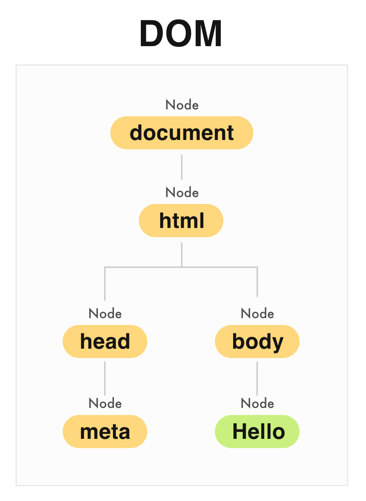
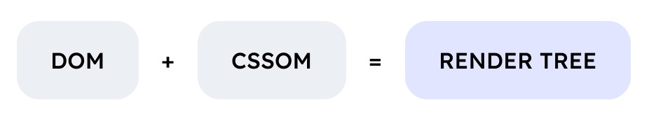
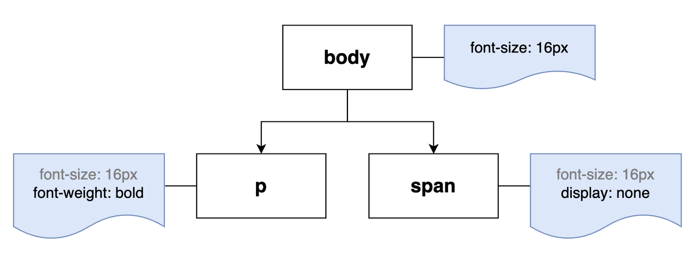
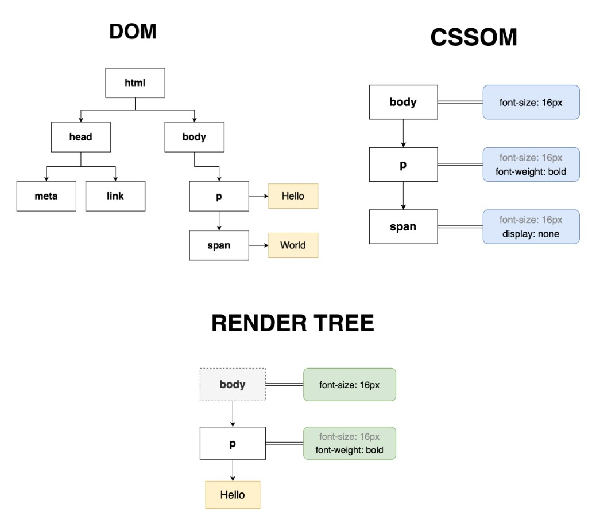

최적화! 왠지 중요하고 챙겨야할 것 같지만 막상 설명하라고 하면 말이 안나오는 그것!
저도 어디선가 줍줍한 지식들로 대략적으로는 알고 있지만 막상 정리하려니 참 어렵게 느껴지더라고요..?!<br/>
사실 꼭 면접에 대비하기 위함이 아니더라도, 사용자에게 좋은 UX를 남겨주기 위해서는 웹 사이트를 사용자에게 빠르고 쾌적하게 보여주는 것이 좋겠죠?

우선 웹 브라우저가 어떻게 화면을 그려내는가(=렌더링)에 대해 살펴보려고 합니다.<br/>
저처럼 UI 개발을 하는 분들은 사용자에게 보여질 View를 자주 다루실텐데, 항상 헷갈리는 이 개념에 대해 자세히 파헤쳐봅시다!!

혹시 맞지 않는 내용이 있다면 언제든 말씀 부탁드립니다😉


## 브라우저: 탐색을 시작합니다

> browse: 둘러보다[훑어보다], 대강 읽다

웹 브라우저는 웹의 다양한 콘텐츠를 탐색할 수 있게 만들어주는 프로그램입니다. 여기에는 크롬이나 엣지 같은 익숙한 이름부터, 브레이브나 토어 같이 다소 낯선 이름들까지,
정말 다양한 브라우저가 존재합니다.


### 웹 브라우저 인기 랭킹 in 한국 (2023년 8월) 
[출처: statcounter](https://gs.statcounter.com/browser-market-share/all/south-korea/#monthly-202208-202308)

> 1. Chrome - 50.7%
> 2. Safari - 18.15%
> 3. Samsung Internet - 15.49%
> 4. Whale Browser - 7.82%
> 5. Edge - 5.85%

예상했던 대로 Chrome이 가장 많은 비중을 차지하고, Safari가 그 다음입니다. 삼성 인터넷도 꽤나 비중이 크네요!

2018년까지만 해도 사용률 2위가 무려 'IE'입니다..! 그만큼 국내에서는 IE의 비중이 굉장히 높았습니다. 그래서 신경을 쓰지 않을 수 없었던 참 얄미운 녀석이었죠..<br/>
하지만 모바일 시장의 확대, 액티브엑스 탈피 등의 시장 변화와 함께 마침내 2022년 IE가 잠들면서 이전에 비하면 스트레스가 줄었다고 할 수 있겠네요.


### 웹 브라우저의 동작

웹 브라우저에 접속해 주소창에 도메인을 입력하면 아주 짧은 순간에 많은 일이 일어납니다. DNS를 통해 IP 주소를 획득하고, TCP를 통해 연결하고, HTTP 요청을 보내 응답을 받습니다. 
이 과정에는 캐싱이 포함됩니다. 이 일련의 과정들은 다음에 더 자세히 알아보도록 하고😋 아무튼, 안전한 HTML 파일을 잘 받아왔다고 가정해봅시다😉


#### 웹 브라우저의 구조

웹 브라우저는 다음과 같은 구조로 이루어져 있습니다.



여기서 집중해서 볼 부분은 바로 '렌더링 엔진'으로, 우리가 만든 마크업과 스타일을 해석해서 그려내는 역할을 합니다.<br/>
물론 두루두루 친해지고 싶지만 일단 여기선 렌더링에 집중해 봅시다!


#### 렌더링 엔진의 종류

어떤 렌더링 엔진을 쓰는지는 웹 브라우저마다 조금씩 다릅니다.

1. Webkit (Safari)
    - Apple에서 개발, 컨커러 브라우저의 KHTML을 기반으로 만든 엔진
    - Safari, iOS 브라우저에서 사용하며, 크롬도 Blink 탑재 전에는 해당 엔진을 사용
2. Blink (Chrome, Whale, Samsung Internet, Edge)
    - Google에서 개발, Webkit에서 파생된 엔진 (Chromium 28 버전부터 적용)
3. Trident (Internet Explorer)
    - Microsoft에서 개발, Internet Explorer에서 사용되었지만 웹 표준 미준수 + 각종 버그 + 보안 문제 등으로 이젠 안-녕
4. EdgeHTML (Edge)
    - Microsoft에서 개발, Trident에서 벗어나 Edge에서 사용되던 엔진이었지만, 2019년부터 Edge 브라우저를 Chromium 기반으로 재구축하면서 이젠 안-녕(2)
5. Gecko (Firefox)
    - Mozilla에서 개발

사실 웹 브라우저를 만드는 비법은 제조사마다 다르고, 각 엔진도 저마다 고유한 개성이 있어 동작 과정이 조금씩 다릅니다.

그롬(그리고 아마 대부분의 최신 브라우저)의 경우 각 탭마다 별도의 렌더러 프로세스가 돌아가고 있어서, 여러 개의 탭을 열면 각가 렌더링 엔진이 동작해 해당 탭의 내용을 표시합니다.<br/>
그래서 하나의 탭이 죽어도 다른 탭은 멀쩡히 살아남을 수 있습니다.

## 웹 브라우저가 화면을 그려내는 과정

그렇다면 HTML, CSS, Javascript를 어쩜 그리 찰떡같이 해석해서 화면을 그려내는 것인가!가 이 글의 제일 궁금한 포인트이기에 그 일련의 흐름을 알아봅시다.

### (1) 삐빅, HTML 읽는 중··· 🔍

HTML 문서를 받기 시작하면 우선 이를 **파싱(Parsing)하는 작업**을 시작합니다.<br/>
파싱이란 문서를 해석하고 구조화된 데이터로 바꾸는 것으로, 말하자면 마크업을 렌더링하기 위한 형태로 바꾸는 단계입니다.

렌더러 프로세스의 메인 스레드는 HTML 문서의 원시 바이트를 읽은 다음, 정해진 파일 인코딩에 맞춰 각각을 문자로 전환합니다. 그러면 아래와 같이 꺽쇄로 묶인 문자열을 읽게 됩니다.

```html
<html>
<head>
   <meta charset="utf-8"/>
</head>
<body>
Hello
</body>
</html>
```

`<html>`이나 `<head>`는 W3C HTML5 표준에 규정된 문자열이므로 각각의 의미와 규칙을 이해할 수 있습니다. 브라우저는 이것들을 쪼개서 '토큰(Token)'으로 만듭니다.<br/>
예를 들어, `<html>`을 보면 html 시작 토큰을 만들고, `</html>`를 보면 html 종료 토큰을 만들어 냅니다. 여기에는 태그 뿐만 아니라 속성(`class` 등)이나, 텍스트 같은 HTML 요소가 포함돼요.



이렇게 문서를 토큰화했으면, 만든 토큰을 가지고 구조화시킵니다.
`<html><head></head></html>`에서 head 종료 토큰은 html 종료 토큰 전에 존재합니다. 따라서 head는 html의 자식이구나! 하고 판단할 수 있어요.



토큰을 파싱해 구조를 만들었으면 각 토큰은 해당하는 '노드(Node)'로 변환됩니다. 노드는 부모-자식이라는 계층적 관계를 통해 문서의 구조를 표현해내는 요소입니다.<br/>
사실 HTML 문서의 모든 것은 노드가 되어 구조를 형성합니다. 태그는 요소 노드(Element Node)가 되고, 그 안에 적은 건 텍스트 노드가 되죠. 속성은 물론, 독타입 선언이나 주석도 모두 노드가 됩니다.



주요 포인트는 **HTML 문서를 읽어 노드로 만들고 계층 형태로 구조화한다는 것!**<br/>
이걸 트리 구조라고도 하는데 말 그대로 나무처럼 생겼어요. 뿌리가 있고 가지가 있으며 거기서 잎이 돋아난 나무를 거꾸로 배치한 것이 트리 구조입니다.<br/>
이렇게 구성된 노드 트리를 **DOM(Document Object Model) 트리**라고도 불러요.

그중에서도 처음으로 생성되는 가장 상위에 있는 노드인 `document`를 루트(Root)라고 부릅니다. 루트 = 뿌리, 노드 = 가지라는 걸 생각하면 귀여운 이름이죠!
참고로 텍스트 노드처럼 자식을 가질 수 없는 노드는 리프(leaf)라고 부릅니다 🌿<br/>
개발자들은 뿌리(document node)를 진입점으로 문서 내 다른 DOM 요소들을 탐색하고 조작할 수 있습니다.


#### DOM? 

아까부터 DOM이라는 단어가 몇 번 언급되었는데, DOM은 말그대로, 문서(Document)를 객체(Object) 기반으로 표현한 모델(Model)입니다.

이 모델은 HTML, XML 등의 문서 내 요소를 객체로 표현해 프로그래밍 언어에서 조작할 수 있게 하는 인터페이스를 제공합니다. 우리는 DOM API를 통해 DOM 객체를 조작할 수 있어요.<br/>
만약 span 텍스트를 바꾸고 싶다면 `document.body.getElementByTagName('span')[0].innerText = 'Hello'`로 접근해 조작하면 됩니다.

1. DOM Object
   DOM에서 문서와 관련된 객체를 뜻하며, 접근하고 조작하기 위한 인터페이스를 제공합니다.<br/>
   프로그래밍적으로 접근하고 조작할 수 있는 객체의 개념입니다.
2. DOM Node 
   DOM Tree(=Node Tree)를 구성하는 온갖 노드들을 말합니다.
   트리 구조를 통해 서로 간의 계층적 관계를 나타내요. 문서를 표현하는 각 콘텐츠를 지칭하는 개념입니다.
3. DOM Element
   DOM Node 중에서도 태그로 표현되는 요소들(`div` 등)을 Element Node라고 합니다.
   이들을 부르는 다른 말이 DOM Element에요.


이렇듯 DOM은 트리 구조로 웹 페이지를 표현하며, 이 DOM 트리를 이루는 구성요소가 바로 노드입니다.



DOM은 후술할 CSSOM이라는 것과 결합해 렌더(Render) 트리를 만들며, 브라우저는 이걸 통해 화면을 그려냅니다.<br/>
따라서 **DOM은 실제로 화면에 보여지는 것과 일치하지 않다**고 할 수 있습니다. 예를 들어, `display: none` 처리한 요소는 화면에 보이지 않지만 DOM에는 존재하며, `:after` 같은 가상요소는 렌더링되었지만 DOM 객체가 아니므로 자바스크립트로 조작하는 것이 불가합니다.

또한, HTML 문서를 보고 만들긴 했지만 DOM이 HTML과 완전히 일치한다고 할 수도 없습니다. 브라우저는 우리가 닫는 태그를 빼먹고 썼더라도 친절하게 DOM을 구성해주니까요.

한편, DOM은 자바스크립트의 영향을 받을 수 있습니다. 예를 들면 `appendChild()` 메서드로 돔을 추가하는 것도 가능하죠! 그래서 자바스크립트에 의해 DOM 파싱은 '방해받을 수' 있습니다.
이에 대한 내용은 다음 글에서 좀 더 살펴보겠습니다.

### (2) 삐빅, CSS 읽는 중··· 🔍

CSSOM은 이름에서 유추할 수 있듯, CSS Object Model의 약자로 CSS 문서를 객체로 나타내고 조작하기 위한 인터페이스를 제공하는 웹 표준입니다.<br/>
렌더링 엔진이 HTML을 쫙- 스캔할 때, 아마 대부분 `<head>`에서 스타일시트를 만나게 될 거에요. 렌더링에 이 CSS가 필요하다고 생각되면 요청해서 스타일시트 내용을 받아오게 됩니다.<br/>
CSS도 파싱 과정을 거쳐서 Bytes -> Characters -> Tokens -> Nodes -> Object Model로 만들어집니다. 이걸 CSSOM이라고 부르고요. 마찬가지로 트리 형태로 구조화되어 있어요.

CSS의 C는 캐스케이딩이죠. 즉, 스타일 규칙은 계단식으로 상속됩니다. 브라우저는 트리 구조를 따라 각 노드에 적용할 수 있는 가장 일반적인 규칙부터 시작해 추가적인 스타일을 적용합니다. 

```css
body { font-size: 16px; }
p { font-weight: bold; }
span { display: none; }
```

예를 들면, `<p>`는 `<body>`의 자식이니까 `<body>`에 적용된 스타일인 `font-size: 16px;`가 적용됩니다. 그 다음에는 자기 자신의 스타일인 `font-weight: bold;`가 추가로 적용됩니다. 



다만 아직 위의 트리는 완전한 CSSOM 트리가 아니에요! 사실 브라우저들은 저마다 기본으로 제공하는 스타일이 있습니다. 개발자 도구를 열어보면 우리가 정의하지 않은 속성이 user agent stylesheet에서 적용된 걸 볼 수 있어요.

#### CSS 속독 비법: 오른쪽부터 읽기

참, 브라우저는 CSS를 빠르게 파싱하기 위해 오른쪽에서 왼쪽으로 읽는다는 사실 아셨나요?! RTL(right-to-left) 파싱 또는 상향식 파싱이라고 하며 말 그대로 셀렉터의 오른쪽(자식)부터 왼쪽(부모)으로 거슬러 올라가며 읽습니다.

```css
header div h1 p span { color: red; }
header span.text { color: red; }
```

위와 같은 두 개의 규칙이 있습니다. 스타일을 계산할 때 어느 쪽이 더 빠를까요?

사실 웬만한 모던 브라우저는 CSS 선택자 매칭 최적화가 되어 있어 이 정도로 큰 차이는 없겠지만 일단 이론상으로는 후자가 좀 더 빠릅니다.

전자는 span부터 시작해, p, h1 등을 거슬러 올라가 header까지 일치하는지 확인해야 합니다. 브라우저가 DOM 트리를 순회하며 요소를 확인해야 하는데, DOM 트리가 크거나 복잡한 경우 속도가 느려질 수 있어요.<br/>
후자는 클래스 셀렉터를 쓰고 있는데, 이렇게 하면 DOM 트리를 탐색할 필요 없이 렌더링 엔진이 알아서 빠르게 인덱싱을 하기 때문에 상대적으로 더 빠릅니다.

이렇게 오른쪽부터 읽는 이유는 스타일을 계산해야 하는 요소는 하나인데 읽어야 하는 규칙은 산더미처럼 많기 때문입니다. 가장 오른쪽부터 시작해서 일치하는지 않는지 먼저 빠르게 판단하면 나머지 셀렉터는 읽지 않고 다음 판단으로 넘어갈 수 있습니다. 
왼쪽부터 읽어야 한다면 DOM 트리 탐색을 위해 전체 HTML을 스캔해서 갖고 있어야 할 수도 있겠죠.

또, 각 브라우저별 렌더링 엔진이 가진 최적화 기술도 RTL 파싱에 적합한 매커니즘을 갖고 있다고 합니다. 하지만 이제 모던 브라우저는 성능이 짱짱하기에 셀렉터 최적화에 너무 매달릴 필요는 없을 것 같네요.


### (3) 삐빅, 렌더 트리 구성하는 중··· 🌳

HTML과 CSS를 읽어 DOM 트리와 CSSOM 트리를 구성했으면, 이제 둘을 결합시켜 렌더 트리를 만들 차례입니다. 렌더 트리는 화면에 실제로 표시되는 시각적 요소를 계층적으로 나타낸 것으로, 얘도 ROM(Render Object Model)이라 부르기도 합니다.

브라우저는 아래와 같은 단계를 거쳐 렌더 트리를 구성합니다.

1. DOM 트리의 루트(document)에서 시작해서 렌더링할 노드를 찾아냅니다.
2. 각 노드에 일치하는 CSSOM 규칙을 찾아 적용합니다.
3. 이제 콘텐츠와 스타일을 결합해 가시적인(visible) 노드를 구성합니다.



**핵심은 눈에 보이는 시각적 요소만 포함한다는 점**입니다. 예를 들어, `display: none`이 적용된 DOM 요소는 화면에 렌더링되지 않으므로 렌더 트리에 포함되지 않습니다.
마찬가지로 `<html>`이나 `<head>`도 시각적인 내용이 없기 때문에 생략됩니다.<br/>
위 이미지에서도 `<span>`은 `display: none`이 적용됐기에 자식인 텍스트 노드("World")는 렌더 트리에서 제외됐어요. 마찬가지로 `<html>`이나 `<head>`도 시각적인 내용이 없기 때문에 생략된 걸 볼 수 있습니다.

덧붙여 `:before` 및 `:after`로 만든 가상 요소는 DOM 요소는 아니지만 화면에 렌더링되므로 렌더 트리에 포함됩니다.


### (4) 삐빅, 설계도 만드는 중··· 📐

지금까지의 흐름을 거쳐 '그려내야 할 것'을 알아냈습니다. 그럼 이제 이대로 화면에 그리면 되는 걸까요? 사실··· 할 일이 더 있습니다. 
구체적으로 어디에 얼마만큼 그려야 하는지 아직 모르기 때문입니다.<br/>
예를 들어 `width: 50%`는 어떤 부모를 기준으로 한 건지, `font-size: 4em`은 어디서부터 계산해야 하는지 아직은 알 수 없어요. 그래서 브라우저는 렌더 트리의 루트부터 시작해
각각의 정확한 위치와 크기를 알아내야 합니다. "width: 50%는 250px이고, font-size: 4em은 22px이군"하고 정확하게 파악하는 거죠.

이 과정을 **'Layout(레이아웃)' 또는 'Reflow(리플로우)'** 라고 부릅니다. 최종적인 설계도를 그리는 단계라 할 수 있겠네요!

브라우저는 [box model](https://developer.mozilla.org/en-US/docs/Learn/CSS/Building_blocks/The_box_model)에 따라 페이지에서 노드가 차지하는 박스를 만들고, 이를 트리 형태로 구조화합니다.
그리고 각 박스의 크기와 위치를 계산해서 페이지의 레이아웃을 구성합니다.


### (5) 삐빅, 화면을 그리는 중··· 🎨

드디어 웹 페이지에 화면을 그릴 수 있습니다! (마침내!)<br/>
레이아웃 단계가 끝나면 **렌더링 트리를 화면의 픽셀로 변환하는 '페인트(Paint)' 이벤트가 실행됩니다.** 여기서도 브라우저는 화면에 그려낼 요소를 트리 형태로 구조화하며, 이를 페인트 트리라고 부릅니다.

#### 합성 단계

화면에 그려내야 하는 단계인 만큼, '페인트' 단계는 렌더링 엔진이 가장 바쁜 구간입니다. 특히 그림자나 그라디언트 같은 렌더링은 페인팅하는 데 시간이 걸리는 비싼 작업이죠.<br/>
그래서 이때 보다 **효율적인 렌더링을 위해 '합성(Composite)' 이라는 과정**을 거칩니다.

합성은 렌더링 파이프라인의 레이아웃 및 페인팅 단계 후에 발생합니다. 최종적으로 보여질 화면을 위해 웹 페이지의 여러 요소를 결합하거나 투명도 효과를 적용합니다. `z-index`, `opacity` 같은 값을 렌더링에 적용하는 거죠.
크롬의 경우, 컴포지터 스레드(compositor thread)라는 별도 스레드가 합성을 담당합니다.

#### 레이어로 나누면 편하니까

이때 요소를 **'레이어'로 분리하여 관리하기 위해 레이터 트리(Layer Tree)를 생성**합니다.

어도비 포토샵을 써보셨으면 레이어 패널에서 눈을 끄거나 켜면서 레이어를 관리한 경험이 있으실 텐데 그것과 비슷합니다! 
예를 들어 사이드 네비게이션 바가 열린 화면을 그려야 하는 경우를 생각해 봅시다. 
기존 메인 화면 위에 그려도 되지만, 레이어 위에 네비게이션 바를 그려서 합성하는 게 훨씬 효율적입니다.
네비게이션을 닫는다고 해도 해당 레이어에만 변화가 일어나니 전체를 다시 렌더링 할 필요도 없죠!

이렇게 웹 페이지를 몇 개의 레이어로 나눈 뒤 컴포지터 스레드에서 각각을 칠하고 합성하면 빠르고 효율적으로 작업을 끝낼 수 있습니다.

레이어 분리 상황을 보고 싶다면 크롬 개발자 도구의 Layers 탭에서 확인할 수 있습니다. 세부사항을 보면 합성 원인도 확인할 수 있어요.
만약 해당 패널이 보이지 않는다면, `Cmd(Ctl)+P`로 검색 창을 띄운 뒤 `>Layers`를 입력하세요!


#### 하드웨어··· 가속!!!

혹시 하드웨어 가속에 대해 들어보셨나요?? 여기서는 CPU가 처리하기 어려운 복잡한 작업을 **GPU에서 처리하도록 하여 성능 향상을 끌어내는 것**을 말합니다. 
GPU는 그래픽 렌더링과 병렬 처리에 최적화되어 있기 때문에 복잡한 그래픽 작업을 보다 효율적으로 처리합니다.
**CSS 속성으로 transfrom, opcity 속성을 사용하면 GPU에서 처리되어 더 부드럽게 애니메이션을 표현할 수 있습니다.**
그 외에 canvas나 WebGL도 하드웨어 가속으로 처리됩니다.

사실 레리어도 세분화해서 나뉘어지지만, 여기서는 하드웨어 가속을 사용하여 처리하는 그래픽 레이어를 가리킵니다.
레이어가 생성되면 일반적으로 하드웨어 가속이 발생하고, GPU에서 레이어들을 합성하여 최종 이미지를 생성합니다.<br/>
하지만 trnasform, opacity 속성을 쓴다고 항상 레이어가 생성되어 하드웨어 가속이 발생하는 것은 아닙니다. 레이어를 관리하는 데는 비용이 들기 때문에 
브라우저는 자기 마음대로(=최적화 상황에 따라) 레이어를 만들지 않거나 서로 합치기도 합니다. 하지만 대부분의 경우는 렌더링 성능을 향상시킬 수 있기에 최대한 
하드웨어 가속 속성을 써서 전환 효과를 만드는 것이 좋습니다.

```css
.slide {
   will-change: transform;
}
```

만약 필요하다면 `will-change`라는 속성을 써서 브라우저에게 해당 요소를 레이어로 승격시키고 하드웨어 가속을 쓰고 싶다고 말할 수도 있습니다.
하지만 이 경우에도 적용할지 여부는 브라우저 마음이라는 점!


#### 최적화 = 일 덜 시키기

화면을 그리기 위해 렌더링 엔진은 **Layout => Paint => Composite** 이라는 과정을 거친다는 것을 알았습니다.
그렇다는 건 화면에 변화가 일어났을 때 해당 영역에서 저 과정을 반복한다는 셈이죠.
그래서 **성능 최적화를 위해서는 레이아웃이나 페인트를 발생시키는 상황을 줄이는 것이 좋습니다**

이른바 리플로우/리페인트라고 부르는, '다시 그리는 비용'을 줄이려면 위 파이프라인에서 합성만 발생하는 것이 가장 좋고요!
즉, 렌더링 엔진에게 일을 덜 시키면 됩니다. 요 내용은 나중에 프레임 최적화를 배울 때 더 살펴보겠습니다.


---

### 요약

> - 국내 브라우저 TOP3 : 1) 크롬  2) 사파리  3) 삼성 인터넷
> - 브라우저의 렌더링 엔진이 HTML과 CSS를 해석해서 화면을 그려준다.
>   - 크롬은 Blink, 사파리는 Webkit, 파이어폭스는 Gecko 엔진을 사용한다.
> - 렌더링 과정<br/>
>   - ① HTML 해석 후 DOM 트리 구성<br/>
>   - ② CSS 해석 후 CSSOM 트리 구성<br/>
>   - ③ DOM + CSSOM 결합하여 렌더 트리 구성<br/>
>   - ④ 레이아웃 계산<br/>
>   - ⑤ 페인트 및 레이어 합성<br/>

---

### 에필로그

브라우저가 웹 페이지를 표시하려면 제법 긴 과정을 거쳐야 한다는 걸 알았습니다.

> ① 리소스 가져오기<br/>
> ② 파싱<br/>
> ③ DOM 트리 & CSSOM 트리 구성<br/>
> ④ 렌더 트리 구성<br/>
> ⑤ 레이아웃 계산<br/>
> ⑥ 페인팅 & 합성<br/>
> ⑦ 렌더링


이를 **'주요 렌더링 경로(CRP; Critical Rendering Path)'** 라고도 부릅니다. 말그대로 사용자에게 꼭 필요한 화면을 렌더링하는 데 필요한 흐름입니다.

그럼 이쯤 드는 생각:
"브라우저가 렌더링을 하는 방법을 알았으니, 이제 어떻게 렌더링 최적화를 할 수 있을지 궁금한데..."

그래서 CRP를 최적화하는 것을 포함해 브라우저가 이미지, 애니메이션 등 리소스를 표현할 때 어떻게 성능 최적화를 할 수 있을지 이제부터 알아봅니다!(빠밤)<br/>
결국 우리의 목적은 웹 페이지를 빠르게 그려내고 상호 작용할 수 있도록 해서 유저의 체감 성능을 높이는 거니까요.😉

그럼, 다음 포스팅도 기대해주세요! 끝까지 읽어주셔서 감사합니다 🙇‍♀️


