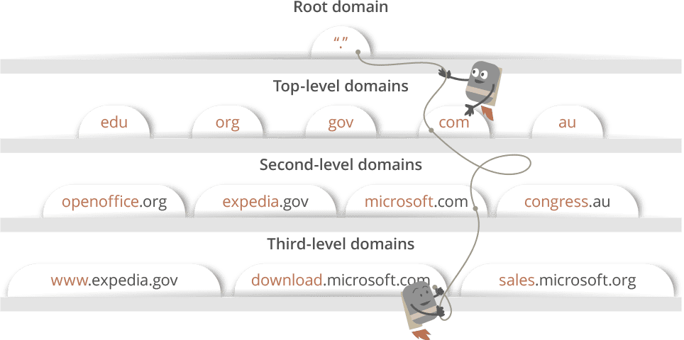
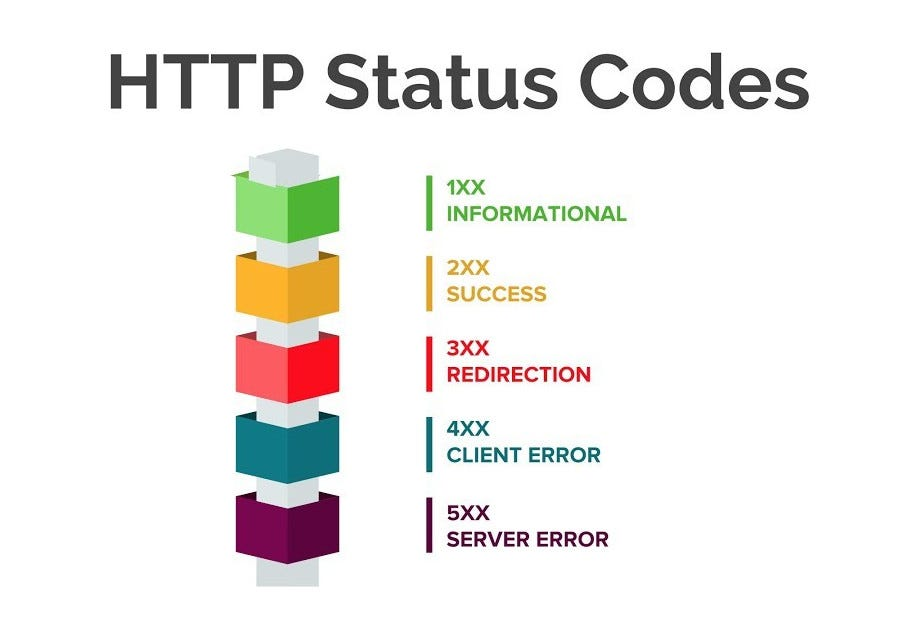

개발자로서 주소창에 특정 웹 페이지의 주소를 입력했을 때, 어떤 과정을 통해 데이터가 전달되고, 화면에 렌더링되는지를 확실하게 알아봅시다. 
(면접에서 나오는 단골 질문이기도 하고..^^)

### 데이터를 받아오는 과정

**1. www.google.com 입력하면 입력한 URL 주소 중, 도메인 이름에 해당하는 google.com을 DNS 서버에서 검색을 합니다.**

웹 브라우저는 DNS 서버에 검색하기 전에 캐싱된 DNS 기록들을 먼저 확인합니다. 
만약 해당 도메인 이름에 맞는 IP 주소가 존재하면, DNS 서버에 해당 도메인 이름에 해당하는 IP주소를 요청하지 않고 캐싱된 IP주소를 바로 반환합니다. 
일치하는 IP 주소가 존재하지 않는다면, 다음 과정인 DNS 서버 요청으로 넘어갑니다.

> DNS(Domain name system) 서버는 도메인 주소에 대응하는 IP 주소를 찾아주는 역할을 수행합니다.

**2. 가장 가까운 DNS 서버에서 해당 도메인 이름에 해당하는 IP주소를 찾아 사용자가 입력한 URL 정보와 함께 전달을 합니다.**

ISP(ex. SK 브로드밴드, KT...)를 통해 DNS서버가 호스팅하고 있는 서버의 IP 주소를 찾기 위해 DNS Query를 전달합니다. 
DNS Query는 현재 DNS 서버에 원하는 IP 주소가 존재하지 않으면 다른 DNS 서버를 방문하는 과정을 원하는 IP 주소를 찾을 때까지 반복합니다. 
해당 도메인 이름에 맞는 IP 주소로 변환하는 과정은 점(.)을 기준으로 계층적으로 구분하여 구성이 됩니다. 
해당 계층의 탐색 순서는 뒤에서부터 해당 도메인 이름에 맞는 지역 DNS를 탐색하며, root DNS 서버가 나올때까지 거꾸로 탐색합니다.

> ex) . => com => google.com

이와 같이 Local DNS 서버가 여러 DNS 서버를 차례대로 물어봐서 답을 찾는 과정을 **Recursive Query**라고 부릅니다.

**3.전달받은 IP주소를 이용하여 웹 브라우저는 웹 서버에게 해당 웹사이트에 맞는 html문서를 요청합니다.**

해당 HTTP 요청 메세지는 TCP/IP 프로토콜을 사용하여 서버로 전송됩니다. 
TCP는 전송 제어프로토콜로 데이터의 전송을 제어하고 데이터를 어떻게 보낼 지, 어떻게 맞출 지 정합니다. 
IP의 특징인 비신뢰성과 비연결성으로 인해 IP 프로토콜 만으로는 통신을 할 수 없습니다. 그렇기에, 신뢰성과 연결성을 책임지는 TCP를 활용하여 통신을 합니다.

> TCP/IP : 데이터가 의도된 목적지에 닿을 수 있도록 보장해주는 통신규약
> - IP(Internet Protocol)
>   - 전 세계 수억대의 컴퓨터가 인터넷을 하기 위해서는 서로의 정체를 알 수 있도록 특별한 주소를 부여했는데 이 주소를 IP주소라 한다.
>   - IP주소는 4바이트로 이루어진 주소번호를 사용한다. ex)192.168.100.100
>   - 숫자로 된 인터넷 주소는 식별하기 어렵기에 인간이 식별하기 쉬운 도메인 이름으로 변환시켜주는 Domain Name 서비스를 사용한다. ex) www.naver.com
>   - Internet Protocol의 줄임말로, 인터넷에서 컴퓨터의 위치를 찾아서 데이터를 전송하기 위해 지켜야 할 규약이다.
> - TCP(Transmission Control Protocol)
>   - 두 호스트가 교환하는 데이터와 승인메세지의 형식을 정의
>   - 서버와 클라이언트간의 데이터를 신뢰성있게 전달하기 위해 만들어진 규약
>   - TCP는 데이터 패킷에 일련의 번호를 부여하여 데이터 손실을 찾아서 교정하고, 순서를 재조합하여 클라이언트에게 전달할 수 있게 해준다. 이는 데이터가 네트워크 선로를 통해 전달되는 과정에서 손실되거나 순서가 뒤바뀌어서 전달될 수 있기 때문에 중요하다.
>   - 복잡해서 신뢰성이 높다.
>   - 인터넷은 패킷을 이용해서 정보를 전달하므로, 이 패킷을 전달하는 규약도 필요하다.
>   - 패킷: 데이터를 일정한 크기로 자른 단위로 인터넷에서 정보를 전달하는 단위이다. 나누어진 패킷이 순서대로 도착한다는 보장이 없으므로 규칙이 필요하다.
>   - TCP는 전달받은 패킷을 재조립하고, 패킷에 손상이 있거나 손실된 패킷이 있다면 재전송을 요청하는 패킷을 전송하여 재전송받는다.
> **즉, IP는 데이터가 찾아갈 주소, TCP는 찾아온 데이터가 형식에 맞게 왔는지 확인하는 필터입니다.**

TCP는 3 way handshake 과정을 통해 연결 및 데이터를 수신받고, 4 way handshake 과정을 통해 연결을 종료합니다.

🎈 **3 way handshake의 과정**

- A 클라이언트는 B 서버에 접속을 요청하는 SYN 패킷을 전송합니다.
- B 서버는 SYN 요청을 받고 A 클라이언트에게 요청을 수락한다는 SYN_ACK flag가 설정된 패킷을 전송합니다.
- A 클라이언트는 B 서버에게 ACK를 전송 후, 연결이 이루어지고 데이터가 오고 가게 됩니다.

🎈 **4 way handshake 과정**

- 클라이언트가 연결을 종료하겠다는 FIN 플래그를 전송합니다.
- 서버는 확인메세지 ACK를 보낸 후, 자신의 통신이 끝날 때까지 기다립니다.
- 서버의 통신이 끝났으면 연결이 종료되었다고 클라이언트에 FIN 플래그를 전송합니다.
- 클라이언트는 확인했다는 메세지 ACK를 보냅니다.

> - 만약, Client에서 세션을 종료시킨 뒤 도착하는 패킷이 있다면 해당 패킷은 Drop되고 데이터는 유실되게 됩니다.
> - 이러한 현상을 위해 Client는 Server로부터 FIN을 수신하더라도 일정시간동안 세션을 남겨놓고 잉여 패킷을 기다리는 TIME_WAIT 과정을 마지막으로 거치게 됩니다.

**4. WAS(Web Application Server)와 데이터베이스에서 웹페이지 작업을 처리합니다.**

웹 서버 혼자서 모든 로직 처리 및 데이터 관리를 하게 되면 서버에 과부하가 일어날 가능성이 높습니다.
그렇기에 서버의 일을 돕는 조력자 역할을 하는 것이 WAS입니다.

WAS는 사용자의 컴퓨터나 장치에 웹 어플리케이션을 수행해주는 미들웨어 입니다.
특정 데이터 요청을 브라우저로부터 받게되면, 웹 서버는 페이지의 로직이나 데이터베이스의 연동을 위해 WAS에게 이들의 처리를 요청합니다.
WAS는 해당 요청을 통해 동적인 페이지 처리를 담당하고, DB에서 필요한 데이터 정보를 받아 그에 맞는 파일을 생성합니다.

> 웹 서버: 정적인 파일(HTML, CSS, 이미지 파일)을 처리 
> WAS: 동적인 파일(JS, TS)을 처리

**5. WAS에서의 작업 처리 결과들을 웹 서버로 전송하고, 웹 서버는 웹 브라우저에게 html 문서 결과를 전달합니다.**

전달 과정에서 status code를 통해 서버 요청에 따른 결과 및 상태를 전달합니다.

> - 1xx: 정보가 담긴 메세지
> - 2xx: response 성공
> - 3xx: 클라이언트를 다른 URL로 리다이렉트 
> - 4xx: 클라이언트 측에서 에러 발생
> - 5xx: 서버 측에서 에러 발생

### 브라우저 렌더링 과정

**6. Critical Rendering Path를 통해 웹 브라우저 화면에 웹 페이지 내용을 출력합니다.**

웹 브라우저에 출력되는 단계를 Critical Rendering Path라고 하며 크게 6단계로 분류됩니다. 
성능을 최적화하려면 수신받은 HTML, CSS, JS 파일들을 어떤 단계를 거치는지 파악한 후, 해당 과정들을 최소화하는 것이 매우 중요합니다.

이 후 과정은 [여기](../web-perform-optimization/)에서 자세히 정리해 놓았으니 참고 부탁드립니당ㅎㅎ

---

### 마무리

프론트엔드 개발 공부를 하면서도 제가 짜는 코드가 어떻게 화면에 구현되는지 모른채 얼레벌레 코드를 짜고 있었다는 것을 알게된 시간이었습니다😅 
공부를 하면서 이런 동작 원리 하나하나가 코드를 짜는 데 중요하다는 것을 알게 되었습니다! 
혹시나 틀린 내용이 있다면 언제든 피드백 부탁드립니다! 🙆‍♀️

---

### 참고

- https://velog.io/@tnehd1998/%EC%A3%BC%EC%86%8C%EC%B0%BD%EC%97%90-www.google.com%EC%9D%84-%EC%9E%85%EB%A0%A5%ED%96%88%EC%9D%84-%EB%95%8C-%EC%9D%BC%EC%96%B4%EB%82%98%EB%8A%94-%EA%B3%BC%EC%A0%95
- https://velog.io/@jhyun_k/%EB%82%B4-%ED%99%94%EB%A9%B4%EC%97%90-%EB%84%A4%EC%9D%B4%EB%B2%84%EA%B0%80-%EC%BC%9C%EC%A7%80%EB%8A%94-%EA%B3%BC%EC%A0%95
- https://velog.io/@thyoondev/%EC%9B%B9-%EB%B8%8C%EB%9D%BC%EC%9A%B0%EC%A0%80%EC%9D%98-%EB%8F%99%EC%9E%91%EC%9B%90%EB%A6%AC%EB%A5%BC-%EC%95%8C%EC%95%84%EB%B3%B4%EC%9E%90
- https://codechasseur.tistory.com/25